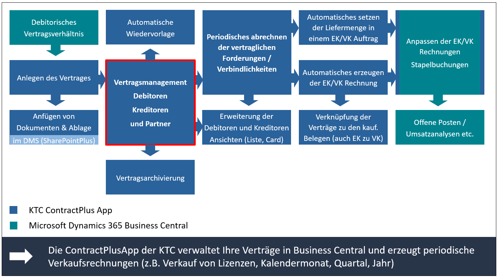

# ContractPlus - MS Business Central App

**Verwalten Sie Ihre Verträge direkt in Business Central**

## Ihre Vorteile:
- Verwalten Sie Ihre Verträge direkt aus Business Central
- Rechnen Sie Ihre Verträge Kundenseitig automatisiert über das System ab.
  - Automatisches Erzeugen der Verkaufsrechnungen
- Anbindung von MS SharePoint als DMS über die App SharePointPlus
- Behalten Sie den Überblick über Laufzeiten, Kündigungen und Vertragsverlängerungen
- Kategorisieren Sie Ihre Verträge
- Weisen Sie Verantwortlichkeiten dem Vertrag zu 
- Fügen Sie Dokumente und Notizen an einen Vertrag hinzu
- Hinterlegen Sie Dimensionen, Bemerkungen und Suchbegriffe zu dem Vertrag.
- Unterstützt werden die Sprachen: Deutsch, Englisch, Italienisch, Französisch, Niederländisch, Spanisch, Portugiesisch und Russisch.

## Mehrwert 

## Setup
### Installation

### Benötigte Systemdaten

**Nummernserien**
- Nummernserie für Kreditorenverträge
- Nummernserie für Debitorenverträge
- Nummernserie für Partnerverträge

**Dimensionen**
- Dimension für Vertragsarten
- Dimension für die Vertragsnummer (Werte werden automatisch erstellt)

### Backend Konfiguration

## Vertragskategorien
