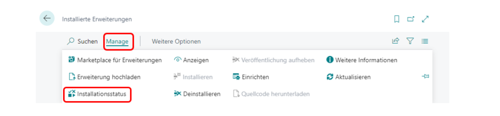
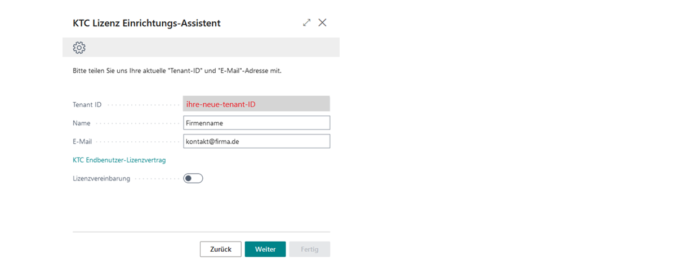
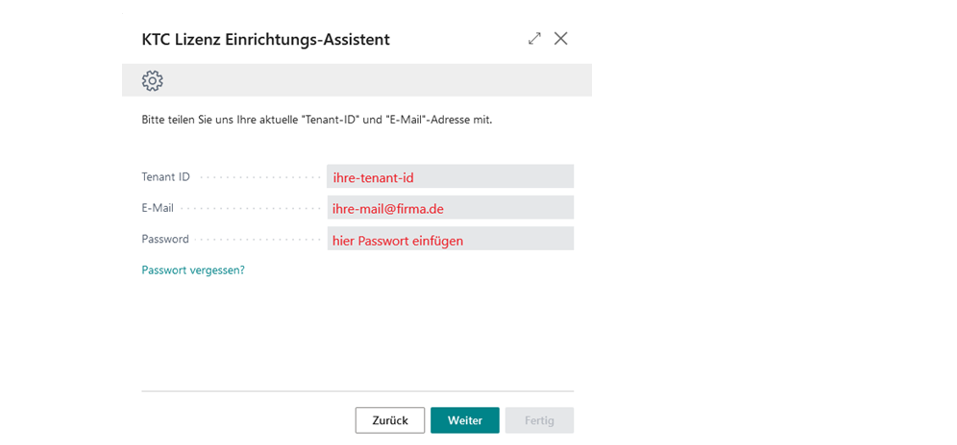
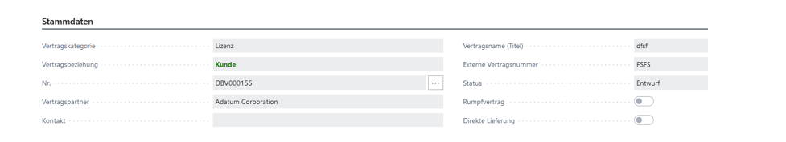

# ContractPlus V1.1 | Vertragsmanagement MS Business Central App

Verwalten Sie Ihre Verträge direkt in Business Central

## Die ContractPlus App

Die KTC ContractPlus App ist eine zentrale Vertragsverwaltung für Business Central. Verwalten und kategorisieren Sie Ihre Verträge nach Kunden, Lieferanten, Partnern und/oder Direktverträgen. Verknüpfen Sie Ihre Originaldokumente, arbeiten Sie mit einem sauberen Audit Trail und lassen Sie Einkaufs- sowie Verkaufsrechnungen automatisiert erstellen.
Eine periodenweise Abrechnung (Kalendermonat, Kalenderjahr) wird mit der ContractPlus App zum Kinderspiel. Sie legen den Vertrag an, die App erstellt die Abrechnung - inklusive der Einkaufsseite, falls Sie Reseller sind.
In der App wird zwischen „automatischer Abrechnung über Verkaufsauftrag“ und „automatischer Abrechnung über Verkaufsrechnung“ unterschieden.
Bei der automatischen Abrechnung über die Verkaufsrechnung kann die Rechnung ohne zugehörigen Verkaufsauftrag erstellt und vor dem Buchen angepasst werden. Das System erstellt anhand der Verkaufsrechnung den entsprechenden Verkaufsauftrag im Nachhinein.
Bei der automatischen Abrechnung über Verkaufsaufträge verwaltet die App für jeden Vertrag die Verkaufsaufträge und die zugehörige Auftragsabrechnung. Somit haben Sie auch Ihre zukünftigen vertraglichen Umsätze als ausstehende Aufträge automatisch im Forecast.
Für alle Vertragsarten können eigene Nummernserien vergeben werden und über Dimensionen können Einkaufs- und Verkaufsposten zu einem Vertrag und zu einem Kunden auf Postenebene zugeordnet werden.

# Inhaltsverzeichnis

1. Ihre Vorteile
2. Ihr Mehrwert
3. Installation und Lizenzmanagement
4. Installation
5. Berechtigungen zur Installation einer Erweiterung
6. Installation über den Marketplace
7. Installation aus dem AppSource
8. Erweiterungsinstallation
9. Installationsfortschritt
10. Aufrufen der KTC Lizenz Management App
11. Initiales Einrichten der Lizenz Management App (Neukunde)
12. Initiales Einrichten der Lizenz Management App (Bestandskunden)
13. Passwort der KTC-Lizenz-Management App zurücksetzen
14. Verwaltung der KTC Lizenzen
15. Update der Anwendung
16. Deinstallation der Anwendung
17. Benutzerhandbuch – ContractPlus App
18. Lizensierung
19. Initiales Einrichten der Anwendung
20. Aktivieren des Anwendungsbereiches (Application Area)
21. Einrichten von Nummernserien und die Wiedervorlage
22. Einrichten der Dimensionen
23. Einrichtung: Löschen archivierter Verträge
24. Grundlagen
25. Abrechnung von Verträgen
26. Einrichten der Vertragsdimensionen
27. Einrichten der Vertragskategorien
28. ContractPlus in der Business Central-Umgebung
29. ContractPlus in den Aktivitäten
30. Vertragsübersicht
31. Vertragskarte – einen neuen Vertrag anlegen
32. Stammdaten
33. Rumpfvertrag
34. Hauptvertrag
35. Vertragszeilen
36. Abrechnung und Wiedervorlage
37. Verantwortlichkeit und Ablageort
38. Vertragsinformationen und -Historie
39. Infoboxbereich
40. Anhänge
41. Links
42. Notizen
43. Die Toolbar
44. Der Vertrag
45. Prozesse
46. ContractPlus im Business Central Rollencenter
47. Rollen und Berechtigungen

### Ihre Vorteile

- Verwalten Sie Ihre Verträge direkt aus Business Central
- Rechnen Sie Ihre Verträge Kundenseitig automatisiert über das System ab.
  - Automatisches Erzeugen der Verkaufsrechnungen
- Anbindung von MS SharePoint als DMS über die App SharePointPlus
- Behalten Sie den Überblick über Laufzeiten, Kündigungen und Vertragsverlängerungen
- Kategorisieren Sie Ihre Verträge
- Weisen Sie Verantwortlichkeiten dem Vertrag zu
- Fügen Sie Dokumente und Notizen an einen Vertrag hinzu
- Hinterlegen Sie Dimensionen, Bemerkungen und Suchbegriffe zu dem Vertrag.
- Unterstützt werden die Sprachen: Deutsch, Englisch, Italienisch, Französisch, Niederländisch, Spanisch und Portugiesisch.

### Ihr Mehrwert

 Abb.1 Mehrwert durch die ContractPlus-App

## Installation und Lizenzmanagement

### Installation

Bitte beachten Sie, dass ContractPlus erst ab Version 21.0 verfügbar ist. Dies bedeutet, dass Ihre Umgebung mindestens auf Version 21.0 geupdatet sein muss, damit die ContractPlus bei Ihnen betriebsfähig ist.  

### Berechtigungen zur Installation einer Erweiterung

hr Unternehmensadministrator muss Ihnen in Business Central folgende Berechtigungen freigeben, um eine KTC-Extension in Ihrer Umgebung zu installieren: D365 EXTENSION MGT oder EXT MGT. -  ADMIN.

 Abb.2 MS D365 BC – Berechtigungen

### Installation über den Marketplace

Die KTC ContractPlus App kann direkt in Business Central über den Marketplace für Erweiterungen installiert werden.
Geben Sie in der Suche Marketplace ein und wählen Sie den Marketplace für Erweiterungen aus.

 Abb.3 Microsoft Marktplace für Erweiterungen (AppSource)

In der Suche des Marketplace geben Sie ContractPlus ein und wählen die unten angezeigte App aus.

 Abb.4 Marketplace ContractPlus

Mit einem Klick auf "Free trial" gelangen Sie in die Erweiterungsinstallation.

## Installation aus dem AppSource

Sie können die App auch direkt aus dem Microsoft AppSource installieren. Melden Sie sich hierfür im MS App Source an und suchen Sie nach der Erweiterung ContractPlus.

 Abb.5 ContractPlus direkt im MS AppSource, Aufruf über den Browser

Auch in dieser Übersicht können Sie die Anwendung über den Button „Free trial“ zu Ihrer Business Central Umgebung hinzufügen.
Klicken Sie auf den "Free trail-Button, dann werden Sie an Ihr Dynamics 365 Business Central weitergeleitet. Es erscheint Ihnen ein Fenster, in dem Sie auswählen können, auf welcher Umgebung Sie die Erweiterung installieren wollen.

 Abb.6 Dynamics 365 Business Central – Auswahl der Umgebung

Mit dem Klick auf Installieren werden Sie in die Erweiterungsinstallation weitergeleitet.

### Erweiterungsinstallation

Die Erweiterung ContractPlus ist nur mit Hilfe einer Lizenzierung nutzbar. Hierfür wird Ihnen bei Installation der Erweiterung automatisch im Hintergrund die KTC Lizenz Management App heruntergeladen. Mit dieser App werden alle Lizenzen für KTC-Anwendungen verwaltet (siehe Aufrufen der KTC Lizenz Management App).
In der Erweiterungsinstallation können Sie aus den verschiedenen Sprachen der ContractPlus Erweiterung auswählen. Die unterstützen Sprachen sind: Deutsch, Englisch, Italienisch, Französisch, Niederländisch, Spanisch, Polnisch und Portugiesisch.
Falls Ihr BC in einer Sprache eingestellt ist, welche nicht von ContractPlus unterstützt wird, wird Ihnen die Erweiterung standardisiert auf Englisch installiert.

 Abb.7 Erweiterungsinstallation: Sprachauswahl und Installation

Mit einem Klick auf Installieren wird Ihnen die Anwendung in Ihrer Umgebung installiert. Die Installation der App kann einige Minuten dauern. Sobald die Extension erfolgreich installiert wurde, erscheint Ihnen eine Meldung. Mit OK werden Sie zurück zum Startbildschirm geleitet.

### Installationsfortschritt

Um die erfolgreiche Installation oder den Installationsfortschritt von Erweiterungen zu sehen, geben Sie in der Suche Erweiterungsverwaltung ein und gehen Sie auf den entsprechenden Menüpunkt.
Über den Punkt Manage können Sie nun die Ansicht  Installationsstatus auswählen.

 Abb.8 Prüfen des Installationsstatus

Eine Erweiterung ist vollständig installiert und betriebsbereit, wenn der Status abgeschlossen ist.

 Abb.9 Installationsstatus: abgeschlossen

### Aufrufen der KTC Lizenz Management App

Sobald Sie eine App über den Marketplace oder MS App Source installieren, müssen Sie die KTC Lizenz Management App einrichten, um die entsprechende App nutzen zu können.
Sollten Sie die KTC Lizenz Management App noch nicht besitzen, wird diese zusammen mit ContractPlus installiert. Diese App stellt die Verbindung zum Lizenzserver her und lässt Sie die verfügbaren Lizenzen abrufen und verwalten.
Wichtig: Bitte beachten Sie, dass ContractPlus ohne die Lizenzverwaltung nicht betriebsfähig ist. Bevor die ContractPlus App gestartet werden kann, muss die KTC Lizenz Management App eingerichtet werden.
Wichtig: Um die KTC Lizenz Management App aufrufen zu können, benötigen Sie die SUPER oder LIC LICENCE USER KTC Rechte.

Zum Öffnen der Lizenzverwaltung geben Sie in der Suche „KTC Liz“ ein und wählen Sie die App KTC Lizenz Management aus.

 Abb.10 Aufrufen der KTC Lizenz Management App

### Initiales Einrichten der Lizenz Management App (Neukunde)

Um ContractPlus als Neukunde unserer Programme zu nutzen, öffnen Sie bitte zuerst das KTC Lizenz Management. Das Programm wird automatisch mitinstalliert, sobald sie ContractPlus aus dem AppSource bezogen haben. Geben Sie hierfür Lizenz in die Suchmaske ein und wählen das Verwaltungsprogramm KTC Lizenz Management aus.

 Abb.11 Aufrufen der Lizenzverwaltung

Beim initialen Aufruf der KTC Lizenz Management App ist Ihre Tenant ID noch nicht gesetzt. Diese wird im nächsten Schritt automatisch ermittelt und gesetzt.

 Abb.12  Einrichten der KTC Lizenz Management Erweiterung

Starten Sie den Einrichtungsassistent und geben bitte Ihren Firmennamen und Ihre E-Mail-Adresse ein. Alle Erweiterungen der KTC werden diesem Firmennamen und dieser E-Mail-Adresse zugeordnet.
Achtung: Sie benötigen diese E-Mail-Adresse zur Wiederherstellung der Zugangsdaten. Zu Abrechnungszwecken kann später eine weitere E-Mail-Adresse hinterlegt werden.
Bitte lesen Sie den Lizenzvertrag und bestätigen Sie, dass sie diesen gelesen haben und akzeptieren.

 Abb.13 Der KTC Lizenz Einrichtungs-Assistent

Danach bestätigen Sie Ihre Eingabe mit Weiter. Die KTC generiert Ihnen nun automatisiert ein Passwort, mit dem Sie sich in der Lizenzverwaltung anmelden können.

 Abb.14 KTC Lizenz Management Passwort (Lizenzschlüssel)

Mit einem Klick auf OK werden die Informationen hinterlegt. Klicken Sie im nächsten Fenster auf fertig, um die Einrichtung fertigzustellen. Die Erweiterung ContractPlus erscheint nun automatisch in der Übersicht der über KTC lizenzierten Anwendungen auf.
Hinweis: Aus Sicherheitsgründen speichern wir Ihr Passwort nicht. Bitte speichern Sie sich Ihr Passwort gesondert ab. Sie benötigen Ihr Passwort, wenn Sie den Lizenz Manager in weiteren Environments wie etwa Sandboxes installieren möchten (z.B. Mehrfachinstallation in unterschiedlichen Tenants mit der gleichen Tenant-ID). Vergessene Passwörter werden systemseitig immer durch neue Passwörter ersetzt.

### Initiales Einrichten der Lizenz Management App (Bestandskunden)

Da Sie bereits eine KTC-Extension installiert haben, sind Sie bereits für die KTC Lizenz Management App registriert.  Dementsprechend besitzen Sie bereits einen Zugang.
Um die Installation der ContractPlus Extension abzuschließen, öffnen Sie den Einrichtungsassistenten der KTC Lizenzmanagement App (z.B. über die Suche -> KTC Lizenz Management).

 Abb.15 Einrichten der KTC Lizenz Management Erweiterung

Nach öffnen des Einrichtungsassistenten geben Sie bitte Ihre bereits vorhandenen Zugangsdaten ein, damit Sie die neue Extension auf Ihren Tenant installieren können. Ihre Tenant-ID wird automatisch für Sie ausgefüllt, Sie müssen also nur noch Ihre E-Mail und das Passwort ausfüllen. Sollten Sie Ihr Passwort vergessen haben, können Sie über „Passwort vergessen?“ ein neues anfordern (vgl. Passwort der KTC-Lizenz-Management App ).

 Abb.16 Mehrfaches Einrichten der KTC Lizenz Management AppErweiterung

Bitte gehen Sie anschließend auf Weiter. Die Einrichtung der KTC Lizenz Management App ist nun abgeschlossen. Es werden automatisch alle gültigen und verfügbaren KTC-Lizenzen vom KTC-Lizenzserver importiert.
Die ContractPlus App ist nun fertig installiert und erscheint in Ihrer Lizenzübersicht.

 Abb.17 Lizenzübersicht

Die Einrichtung der KTC Lizenz Management App ist nun abgeschlossen. Sie können die ContractPlus App nun nutzen.

### Passwort der KTC-Lizenz-Management App zurücksetzen

Über die Funktion Passwort vergessen? können Sie sich ein neues Passwort (= Lizenzschlüssel) generieren lassen. Es wird ein neuer Tab geöffnet, in dem Sie die E-Mail-Adresse, die mit der Lizenz verlinkt ist, eingeben und auf "Absenden" klicken.

 Abb.18 zurücksetzen des Passwortes (Lizenzschlüssel)

An diese E-Mail wird ein Link versendet. Klicken Sie auf den Link, um das neue Passwort zu erhalten. Bitte speichern Sie sich dieses gesondert ab. Das alte Passwort verliert hiermit seine Gültigkeit.

 Abb.19 Neues Passwort (Lizenzschlüssel) erhalten

### Verwaltung der KTC Lizenzen

Möchten Sie den Status Ihrer Lizenzen überprüfen, öffnen Sie die KTC Lizenz Management App und wählen die zu prüfende Anwendung aus (1) und klicken Sie auf Aktualisieren (2)
In der Übersicht sehen Sie ob die Lizenz Gültig ist, wenn Sie detaillierte Informationen benötigen, finden sie weitere Informationenunter Verwalten.

 Abb.20 Manuelles kontrollieren der installierten Lizenzen

Wenn Sie die App nicht mehr benutzen möchten, können Sie in der Erweiterungsverwaltung die installierten Apps markieren und deinstallieren.

### Update der Anwendung

Die Anwendung wird über das Microsoft Dynamics 365 Business Central Admin Center aktualisiert. Die KTC Lizenz Management App zeigt Ihnen zusätzlich an, ob neue Versionen der KTC-Erweiterungen vorliegen.

 Abb.21 Das Microsoft Dynamics 365 Business Central Admin Portal öffnen

Um Ihre App-Übersicht zu öffnen, gehen Sie über Environments  manage apps auf eine Liste der installierten Anwendungen. In dieser Liste werden Ihnen unter anderem die installierte Version und die Information, ob „Ihre“ Version auch die aktuelle ist (vgl. Abbildung 21).

 Abb.22 Auswahl der Umgebung im Dynamics 365 Business Central Admin Center

Falls nötig, können Sie hier unsere Anwendung auf den neuesten Stand updaten. Dazu müssen Sie zunächst die Erweiterung auswählen, die Sie updaten möchten.
Gehen Sie hierfür auf Apps -> Manage Apps -> Update. Die Anwendungen KTC Lizenz Management und ContractPlus werden jetzt auf den neuesten Stand gebracht. Sobald die Aktualisierung abgeschlossen ist, können Sie das Admin Center verlassen und mit den Anwendungen in Ihrer Business Central-Umgebung weiterarbeiten.

### Deinstallation der Anwendung

Geben Sie in der Suche der Business Central Aktivitätenübersicht „Erweiterung“ ein und wählen Sie die Erweiterungsverwaltung aus.

 Abb.23 Aufrufen der Erweiterungsverwaltung

Markieren Sie die KTC Licence Management App und wählen Sie Verwalten -> deinstallieren aus. Alternativ können Sie auch auf das Ja klicken, das in der Erweiterungsübersicht vor der Anwendung KTC Licence Management steht. Wählen Sie im nächsten Fenster aus, ob Sie die Daten, die in der Erweiterung angelegt wurden, auch gelöscht werden sollen, und bestätigen Sie die Installation mit Deinstallieren. Die Anwendung wird jetzt aus Ihrem System entfernt; alle Daten dieser Anwendung werden gelöscht.

Hinweis: Wird das KTC Licence Management deinstalliert, ist die Nutzung der SharePointPlus-Erweiterung sowie anderer unserer Produkte nicht mehr möglich.

## Benutzerhandbuch – ContractPlus App

### Lizensierung

Die ContractPlus App stellt verschiedene Lizenzen zur Verfügung. Die Lizensierung erfolgt über die mitinstallierte KTC Lizenz Management App).
Wenn Sie im Marketplace oder im MS AppSource die ContractPlus App herunterladen und installieren, erhalten Sie automatisch eine 30-tägige Testlizenz.
Nach Ablauf der Lizenz, um ContractPlus weiterhin nutzen zu können, kontaktieren Sie uns per Mail an Anfrage.D365BC-Apps@ktc.de, mit der Information über die Anzahl Ihrer User. Die aktuellen Preise der ContractPlus App können Sie dem ContractPlus Flyer entnehmen.
Um die ContractPlus App nutzen zu können, benötigen Sie die CNP LIC User KTC.

### Initiales Einrichten der Anwendung

Wichtig: Um die Einrichtungsseite der ContractPlus App aufrufen zu können, benötigen Sie die SUPER oder CNP ADMIN KTC Rechte. Um die ContractPlus App nutzen zu können, benötigen Sie entweder die Testlizenz oder eine gekaufte Lizenz. Die Rechte, die Sie mit den Lizenzen erhalten, heißen CNP LIC User KTC.

### Aktivieren des Anwendungsbereiches (Application Area)

Geben Sie ContractPlus in die Suchleiste ein und wählen Sie die ContractPlus Einrichtung aus, um die Einrichtung durchzuführen.

 Abb.24 ContractPlus-Einrichtung

n der Verwaltung von ContractPlus können Sie die Anwendung im aktuellen Mandanten aktivieren oder deaktivieren. Somit kann individuell definiert werden, welche Mandanten mit der Erweiterung ContractPlus arbeiten können.

 Abb.25 ContractPlus aktivieren

Ohne die Aktivierung des Buttons ist die Nutzung von ContractPlus im ausgewählten Mandanten nicht möglich. Nach betätigen des Buttons ContractPlus Aktivieren, wird das Fenster automatisch geschlossen. Für die weitere Einrichtung müssen Sie erneut über die Suche die ContractPlus Einrichtung aufrufen.

### Einrichten von Nummernserien und die Wiedervorlage

Mit Aktivieren der App wird es notwendig, im Unterpunkt Einrichtung einige erste Einstellungen festzulegen. Für jede Vertragsart kann hier eine eigene Nummernserie definiert werden.

Achtung: Die Nummernserien müssen sich unterscheiden, da sonst verschiedene Vertragsarten in die gleiche Serie eingeordnet werden. Das kann zu fehlerhaften Auswertungen führen.

 Abb.26 Einrichten der Nummernserien

 Abb.27 Ist die Wiedervorlage Personen- oder Teamorientiert

Wenn Sie einen Vertrag erneut ansehen möchten, bevor Sie ihn verlängern oder fristgerecht kündigen, können Sie die Wiedervorlage nutzen. Bei der Erstellung des Vertrags legen Sie ein Datum fest, an dem der Vertrag erneut angezeigt und gegebenenfalls bearbeitet werden soll.
In der Vertragskarte können Sie jedem Vertrag einen verantwortlichen Mitarbeitenden zuweisen, der sich darum kümmert. Wünschen Sie, dass die Erinnerung über den Vertrag an alle Mitarbeitenden des zuständigen Teams gesendet wird, so aktivieren Sie hier den Schalter Team Wiedervorlage. So werden alle Teammitglieder informiert.
Beispiel: Bei einem Verkaufsvertrag wird die Teamleitung des Sales-Teams als verantwortliche Person festgelegt. Da hier Team Wiedervorlage aktiviert wurde, wird der Vertrag im Rollencenter für jedes einzelnen Teammitgliedes hinter der Kachel Verträge auf Wiedervorlage hinterlegt.

### Einrichten der Dimensionen

ContractPlus benutzt Dimensionen, um Verträge auf Postenebene zuzuordnen. Diese können Sie ebenfalls in der ContractPlus Einrichtung definieren.

 Abb.28 Einrichten der Dimensionen

Die Dimension Vertragstyp dient zur Kategorisierung des Vertrages und wird automatisch über die Vertragskategorie gesetzt.
Die Dimension Vertragsnummer ist eine automatische Dimension, die die Vertragsnummer auch in der Dimension speichert. Dies vereinfacht eine spätere Auswertung erheblich, da die Vertragsnummer auf Postenebene zur Verfügung steht. Beim Direktvertrag ist dies die Vertragsnummer ohne Debitor- oder Kreditorsuffix.
Die Dimension Debitor erwartet die Debitorennummer in der Dimension. Mit dieser Dimension können Verträge auf Postenebene Kunden zugeordnet werden; dies gilt insbesondere für den kreditorischen Vertrag im Streckengeschäft.
Die Kundennummer-Dimension wird einmal täglich automatisch aktualisiert. Hier werden automatisch alle Ihrer Kunden hinterlegt. Der jeweilige Dimensionswert entspricht hier der Kundennummer. Diese Dimension ist bei Direktverträgen von Nutzen, da Sie bei der Auswertung hilft, einzelne Einkaufsposten zum Kunden zuzuordnen.

Beispiel: Sie fügen den Kunden „Wayne Enterprises“ zu Ihrer Kartei hinzu. Dieser erhält nun die Kundennummer „D00460“. Alle Verträge, die mit diesem Kunden zusammenhängen, erhalten nun vom System die Dimension CUSTOMER mit dem Wert D00460. So können Sie nicht nur Verträge, sondern auch die einzelnen Posten aus den Verträgen in Bezug auf den Kunden auswerten.

### Einrichtung: Löschen archivierter Verträge

 Abb.29  Archivierte Verträge löschen

Diese Funktion erlaubt das Löschen von archivierten Verträgen. Weiter können Sie definieren, welche Art von archivierten Verträgen gelöscht und welche beibehalten werden sollen. Insgesamt haben Sie hier drei verschiedene Optionen zur Auswahl: archivierte Kundenverträge, archivierte Lieferantenverträge und archivierte Partnerverträge. Von diesen Einstellungen sind nur Verträge betroffen, die auch diesen Vertragsarten entsprechen.

## Grundlagen

### Abrechnung von Verträgen

Der Warenfluss beinhaltet mehrere Schritte. In der Grafik können Sie erkennen, dass ContractPlus einen Großteil des kaufmännischen Prozesses für Sie übernimmt. So haben Sie Zeit für andere Aspekte Ihres Unternehmens.

 Abb.30 Verträge abrechnen

Verträge können auf verschiedenen Wegen abgerechnet werden. Zwei Wege, die von Business Central unterstützt werden, sind die Abrechnung über die Verkaufsrechnung und die Abrechnung über den Verkaufsauftrag. Mithilfe von ContractPlus können Sie Verträge auf beiden Wegen abrechnen.
Alle in ContractPlus angelegte Verträge werden mit Vertragskategorien verknüpft, mit denen Sie festlegen können, auf welchem Wege der Vertrag abgerechnet werden soll.

 Abb.31 Vertragskategorien

Die Vertragskategorien sind von Ihnen frei festlegbar. Bitte beachten Sie, dass in den Kategorien nur die automatische Abrechnung über den Auftrag aktiviert werden kann. Sollten Sie die Verträge lieber händisch abrechnen, lassen Sie das Kästchen deaktiviert.

### Vertragsarten

ContractPlus unterscheidet vier Vertragsarten, die nachfolgend beschrieben werden.

Debitorenverträge sind Verträge, die Sie mit Ihren Kunden abschließen. Daher werden sie auch Kundenverträge genannt. In ContractPlus können Sie diese entweder über die jeweiligen Verkaufsaufträge oder über die Verkaufsrechnungen abrechnen.
Kreditorenverträge hingegen sind die Verträge, die Sie mit Ihren Lieferanten abschließen. In ContractPlus können Sie mithilfe dieser Vertragsart sowohl Einkaufsverträge als auch Einkaufsrechnungen erstellen.
Partnerverträge sind Verträge, die weder einkaufsseitig noch verkaufsseitig Verträge besitzen. Stattdessen beschreiben Sie den Zusammenschluss zweier oder mehrerer Unternehmen, damit diese als eine Einheit fungieren können. Beispielsweise können Sie mithilfe von Partnerverträgen Waren und Dienstleistungen vertreiben, die Ihr Unternehmen gemeinsam mit einem anderen Unternehmen entwickelt hat. Ein- und Verkaufsverträge, die sich aus Partnerverträgen ergeben, können Sie über ContractPlus verwalten.
Direktverträge werden über Waren oder Dienstleistungen geschlossen, die eingekauft und direkt weiterverkauft werden (debitoren- und kreditorenseitig). Diese werden zum Teil auch als Streckengeschäfte oder Reselling bezeichnet. Sie übernehmen hier lediglich die Vermittlung; da der Hersteller den Vertrag in der Regel direkt beim Kunden erfüllt, ohne dass Sie für Dinge wie etwa Lagerhaltungs- oder Lieferkosten aufkommen müssen. ContractPlus verknüpft die hierfür benötigten Verträge für Sie miteinander. In ContractPlus werden Sie hierfür keine gesonderte Vertragskategorie finden.

## Einrichten der Vertragsdimensionen

Hiermit erstellen Sie die Dimensionswerte für Ihre Vertragskategorien. Basierend auf diesen Werten können sie später Ihre Verträge auswerten.
Suchen Sie hierfür zunächst in der Suchmaske nach „Dimensionen“.

 Abb.32 Die Dimensionen verwalten

Wählen Sie hier zunächst die Dimension aus, die Sie pflegen möchten. Anschließend wählen Sie über den Reiter Dimension die Taste Dimensionswerte aus.
Dort können Sie dann bereits vorhandene Dimensionswerte bearbeiten oder einen neuen Wert mit einem zugehörigen Code sowie Namen über "+Neu" erstellen.

 Abb.33 die Dimension „Contract Type

## Einrichten der Vertragskategorien

Wichtig: Die ContractPlus App muss vollständig eingerichtet sein, um die Vertragskategorien verwalten zu können. Vergleichen Sie zur dazu bitte 5.3 Initiales Einrichten der Anwendung.

 Abb.34 Dimensionswerte für Vertragsarten

Nachdem die Dimensionen für die Vertragsarten eingepflegt sind, können nun die Vertragskategorien angelegt werden und einer der definierten Dimensionen zugewiesen werden.
Vertragsbeziehung definiert, in welcher Beziehung wir zu unserem Vertragspartner stehen. Diese sind dann natürlich von der Vertragsart abhängig. Jede Vertragsart unterhält eine eigene Vertragsbeziehung, von der die Konditionen der beteiligten Parteien abhängen. Diese Beziehungen lauten: Kunde, Lieferant, und Partner. Nummer und Beschreibung können Sie hier frei festlegen, während die Beziehung aus einer der vorgegebenen Möglichkeiten gewählt wird.
Unter Dimensionswert wird die Dimension für diese Kategorie festgelegt. Alle Einträge dieser Kategorie werden nun automatisch der hinterlegten Dimension zugeordnet.

 Abb.35 Vertragskategorien verwalten

Die automatische Abrechnung über einenVerkaufsauftrag ist ein Vorgabewert für diese Kategorie. Er bestimmt, ob der Eintrag zusammen mit dem Verkaufsauftrag abgerechnet wird. Diese Option können Sie hier aktivieren oder deaktivieren. Für jeden Eintrag der Liste ist eine individuelle Einstellung möglich.
Die änderbare Vertragsabrechnung legt fest, ob in dieser Vertragskategorie die Mengen für jeden Abrechnungsintervall angepasst werden können. Dies ist sinnvoll, wenn Ihre Kunden (oder Sie selbst) nicht jeden Monat die gleiche Menge benötigen. Auch diese Option können Sie hier aktivieren oder deaktivieren, und für jeden Eintrag individuell festlegen.

## ContractPlus in der Business Central-Umgebung

### ContractPlus in den Aktivitäten

 Abb.36 ContractPlus „Kacheln“ im Rollencenter

Ihre Verträge sind hier auf insgesamt vier Kacheln verteilt. Die linke Kachel, Verträge, öffnet eine Übersicht aller Ihrer Verträge. Hier können Sie auch neue Verträge erstellen. Die zweite Kachel von links, „aktive Verträge Kunde und Lieferant“ zeigt Ihnen eine Übersicht über alle Direktverträge. Die dritte Kachel mit dem Titel „aktive Verträge Kreditoren“ verbirgt eine Auflistung aller Kundenverträge. Unter „Verträge auf Wiedervorlage“ finden Sie jene Verträge, die demnächst zur erneuten Ansicht fällig sind, sofern Sie diese zur Wiedervorlage markiert haben (vgl. Abrechnung und Wiedervorlage).

### Vertragsübersicht

Durch Klicken auf eine der Kacheln in den Aktivitäten kommen Sie zu einer Listenübersicht der hier hinterlegten Verträge. In dieser Ansicht können die Verträge über verschiedene Filter ein- oder ausgeblendet werden.

 Abb.37 : Vertragsübersicht

In der Vertragsübersicht werden folgende Informationen angezeigt:

• Vertragsnummer
• Vertragspartner
• Vertragsname
• Vertragskategorie
• automatische Abrechnung über Vertrag
• automatische Abrechnung über Rechnung
• Tage bis zum nächstmöglichen Kündigungstermin
• Nächste Wiedervorlage
• Status
• Gekündigt durch
• Vertragsbeziehung

Sämtliche dieser Informationen werden aus der jeweiligen Vertragskarte ausgelesen und je nach Bearbeitungsstand angepasst.

 Abb.38 : der Reiter „Verträge“ in der Übersicht

In der Vertragsübersicht finden Sie außerdem verschiedene Reiter, die weitere Funktionen von ContractPlus enthalten. So können Sie sich im Reiter Verträge Kunden-, Lieferanten- oder Partnerverträge anzeigen lassen, die mit dem in der Übersicht ausgewählten Vertrag verknüpft sind. Im Vertragsarchiv finden Sie bereits archivierte Verträge, und in den Kategorien können Sie eingespielte Kategorien anpassen, hinzufügen oder verändern.
Im Reiter Prozess sind Ihnen Verwaltungsoptionen für den gewählten Vertrag hinterlegt. Beispielsweise können Sie den Vertrag verlängern, wenn die automatische Verlängerung nicht aktiviert wurde. Sie können Ihre Einträge archivieren, zur Wiedervorlage markieren oder archivierte Verträge wiederherstellen.

 Abb.41 : der Reiter „Prozess“ in der Übersicht

### Vertragskarte – einen neuen Vertrag anlegen

Mit einem Klick auf "+Neu" gelangen Sie aus der Vertragsübersicht in eine neue Maske, in der Sie einen neuen Vertrag anlegen können.

Grau hinterlegte Felder werden automatisch ausgefüllt; hier müssen Sie keine Daten eingeben. Mit rotem Stern  markierte Felder hingegen sind Pflichtfelder; diese benötigen unbedingt eine Dateneingabe Ihrerseits.

### Stammdaten

 Abb.42 : Stammdaten des Neuvertrages

Hier wählen Sie zunächst über "..." eine bereits vorher erstellte Vertragskategorie aus (vgl. Einrichten der Vertragskategorien). Die Vertragsbeziehung wird hier automatisch und passend zur ausgewählten Kategorie ausgefüllt.
Auch die Vertragsnummer wird automatisch und fortlaufend ergänzt; sollten Sie aber eine spezielle Vertragsnummer wünschen, können Sie diese unter "..."  auswählen oder frei erstellen, indem Sie auf  "+Neu" klicken.
Bei Kontakt können Sie mit "..." einen bereits hinterlegten Kontakt verlinken, neu erstellen oder über Freitext Ihre Informationen eingeben.

Wichtig: Diese sind nicht mit Ihrer Datenbank verlinkt.
Unter Vertragsname (Titel) können Sie Ihrem Vertrag eine Bezeichnung zuweisen.
Falls Ihnen von der anderen Partei bereits eine eigene Vertragsnummer für deren Akten vorliegt, ist im Feld externe Vertragsnummer Platz, diese einzufügen.
Der Status informiert Sie in der Vertragsübersicht über den aktuellen Zustand.
Zustände können etwa sein: Entwurf, aktiv, storniert, gekündigt.

Mit den Schaltern automatische Abrechnung über Verkaufsauftrag und automatische Abrechnung über Verkaufsrechnung können Sie automatisch mit der Vertragserstellung einen Verkaufsauftrag erstellen lassen. Der Auftrag wird im Hauptvertrag verlinkt (vgl. Hauptvertrag) und in der Vertragshistorie geloggt. Die Erstellung erfolgt im Hintergrund; Sie brauchen hierfür nichts weiter tun, als den Schalter umzulegen.

Mit dem Schalter Rumpfvertrag wird ein Abschnitt des Interfaces aktiviert beziehungsweise deaktiviert, mithilfe dessen Sie einen Vorgänger zum Hauptvertrag einfügen können.
Sind Sie lediglich die mittelnde Stelle, können Sie hier die Option direkte Lieferung anwählen, um den entsprechenden Gegenvertrag gleich miterfassen zu können. So müssen Sie dies nicht für jede Seite einzeln vornehmen.

### Rumpfvertrag

 Abb.43 den Rumpfvertrag anlegen

In dieser Maske wird lediglich das Startdatum des Rumpfvertrages ausgewählt. Im folgenden Abschnitt legen Sie das Startdatum des zugehörigen Hauptvertrages fest; auf Grundlage davon ermittelt und ergänzt die Anwendung das Enddatum des Rumpfvertrages für Sie.

### Hauptvertrag

 Abb.44 Hauptvertrag anpassen

Zunächst wird hier der Vertragsintervall erfasst: Wie oft soll der Vertrag während der Laufzeit erfüllt werden? Möchten Sie den Vertrag jeweils vom ersten des Monats bis zum letzten des Monats ausführen, wählen Sie hier Kalendermonat aus. Wenn Ihnen vom 01.01. bis zum 31.12. lieber ist, ist das Kalenderjahr für Sie. Möchten Sie jährlich abrechnen, aber nicht vom 01. Januar bis zum 31. Dezember, können Sie hier jährlich auswählen. Das Startdatum des Vertrages können Sie hier dann frei wählen. Sollten Sie einen Rumpfvertrag erstellt haben, kann das Startdatum allerdings erst nach dem Auslaufen des Rumpfvertrages sein.
Beispiel: Wenn der Rumpfvertrag ab dem 01.10. als Übergangslösung bis zum 31.12. abgeschlossen wird, kann der Hauptvertrag nicht vor dem 01.01. starten.
Die Mindestvertragslaufzeit und die Kündigungsfrist zum Vertragsende, also den letzten Termin zur ordentlichen, fristgerechten Kündigung, können Sie hier mithilfe folgender Kürzel festlegen:

- T –Tag(e)
- WT – Wochentag(e)
- W – Woche(n)
- M – Monat(e)
- Q – Quartal(e)
- J – Jahr(e)

Die Kürzel sind ebenfalls im Tooltip für Sie hinterlegt.
Die automatische Verlängerung kann genutzt werden, wenn der Vertrag so, wie er ist, ohne Eingreifen Ihrerseits so lange weiterlaufen soll, bis er von einer der beteiligten Parteien manuell gekündigt wird.
Die rechte Hälfte des Interfaces ist grau hinterlegt und wird von der App selbstständig ausgefüllt. Hier werden Daten und Kontakte für Abrechnung und Kündigung vom System angefügt.
Wenn Sie die automatische Abrechnung über die Verkaufsrechnung aktiviert haben, wird beim erstellten Vertrag der zugehörige Auftrag verlinkt.

### Vertragszeilen

Die Vertragszeile Rumpfvertrag wird bei Bedarf automatisch ergänzt. Lediglich die Tabelle Vertragszeile Hauptvertrag bedarf Ihrer Eingaben.

 Abb.45 Vertragszeile Hauptvertrag (I)

Hier können Artikelnummern und -Beschreibungen entweder händisch eingegeben oder aus einem vorher festgelegten Pool von Auswahlmöglichkeiten eingefügt werden.  Sollten Sie die Informationen aus dem Pool beziehen, werden die nachfolgenden Felder Einheitencode und Abrechnungspreis automatisch ergänzt. Ansonsten sind diese von Ihnen einzutragen.
Bitte beachten Sie, dass ContractPlus und Business Central über Eintragungen, die nicht entsprechend ins System eingepflegt wurden, keine statistischen Auswertungen machen können. Wir empfehlen daher das vorherige Einpflegen Ihrer Artikel.

 Abb.46 Vertragszeile Hauptvertrag (II)

Sollten Sie „Artikel“ in der Zeile Art eingegeben haben, werden zwei weitere Felder angefügt, die ausgefüllt werden müssen. Der Lieferantenname muss zwingend angegeben werden. Selbstverständlich können Sie in jeder Zeile einen individuellen Lieferanten angeben. Mit Erstellung des Vertrages wird jeder Zeile ein eigener, korrespondierender Auftrag zugewiesen. Haben Sie in mehreren Zeilen denselben Lieferanten angegeben, so werden die Positionen in einem Sammelauftrag zusammengefasst. Die zugehörige Auftragsnummer wird in der Vertragskarte dann unter „Einkaufsbestellnummer“ ergänzt.
Mit den zwei Feldern zum Datum können Sie Zeiträume definieren, in denen die gewählte Vertragszeile erfüllt werden soll. Soll die Zeile in jedem Intervall erfüllt werden, lassen Sie die Felder bitte leer.
Bei Bedarf können noch Abgrenzungsvorlagen definiert werden. Mithilfe von Abgrenzungsvorlagen ist es Ihnen möglich, Einnahmen und Ausgaben zu einem Artikel zuzuordnen, wenn die finanzielle Seite in einer anderen Periode als die Buchung der Transaktion stattfindet. Im Feld Bemerkungstext können Sie außerdem per Zeichenkombinationen verschiedene Informationen auf der Rechnung verzeichnen lassen. Diese Kombinationen sind:

%1 - Vertragsnummer
%2 – Vertragsdatum
%3 - Periodennummer
%4 - Abrechnungszeitraum von Datum
%5 - Abrechnungszeitraum bis Datum
%6 - Vertragsstatus
%7 - Externe Vertragsnummer

Diese Auflistung können Sie auch über den Tooltip abrufen.

### Abrechnung und Wiedervorlage

 Abb.47 Abrechnungsmodalitäten und Wiedervorlage

Der erste Schalter gibt an, ob der offene Betrag im Voraus bezahlt und über die Vertragslaufzeit verteilt wird oder nicht. Wenn ja, aktivieren Sie bitte diese Funktion.
Das erste Abrechnungsdatum wird aus dem Hauptvertrag (ggf. Rumpfvertrag) übertragen. Ändern Sie es nur, wenn besondere Umstände, etwa den ersten Auftrag kostenfrei, dies erfordern.

Der Zahlungsformcode lässt die Filterung nach Zahlungsarten, also Scheck, Bankverbindung, Barzahlung und dergleichen zu.
Bei Zahlungsbedingungscode sind verschiedene Zahlungsbedingungen zu finden, die auf Rechnungen erscheinen sollen, Zahlungsziel 14 Tage nach Rechnungserhalt etwa.

Die Wiedervorlage soll Sie an den Vertrag erinnern, sodass Sie ihn, falls nötig, fristgerecht kündigen oder manuell verlängern können. Sie ist keine Vorlage zum Wiederverwenden für einen identischen oder ähnlichen Vertrag.

### Verantwortlichkeit und Ablageort

 Abb.48 Verantwortlichkeit und Ablage

Sowohl bei Vertragsunterzeichner als auch bei Vertragsverantwortlicher können bereits hinterlegte Mitarbeitende bestimmt werden. Natürlich können Sie auch hier neue Mitarbeitenden hinzufügen. Die hier hinterlegten Mitarbeitenden dürfen, müssen aber nicht identisch sein. Alternativ können Sie ein verantwortliches Team bestimmen, sollten Sie die Verantwortung nicht nur einer Kraft allein übertragen wollen. Wenn Sie bei der Einrichtung von ContractPlus die Option Team Wiedervorlage aktiviert haben, werden Erinnerungen zum Vertrag an das gesamte Team der verantwortlichen Person gesendet.
Unter Ablageort können Sie notieren, wo der Vertrag abgelegt wurde. Das kann eine URL sowohl im Internet als auch im Intranet, oder aber auch ein Speicherpfad sein, deren Adresse Sie abtippen oder hineinkopieren könnten. Sie können auch den Verbleib einer gedruckten Kopie hinterlegen; da hier automatisch ein Hyperlink erstellt wird, führt der in diesem speziellen Fall allerdings ins Nichts.

### Vertragsinformationen und -Historie

Im Textfeld unter Vertragsinformationen können Sie wichtige Anmerkungen, zusätzliche Daten und dergleichen direkt am Vertrag sichtbar hinterlassen.

 Abb.49 Informationen und Historie

In der Vertragshistorie werden Änderungen am Vertrag erfasst. Diese Änderungen könnten der Auftragsturnus, aber auch die Kontaktdaten oder geänderte Zahlungsbedingungen sein. Diese Tabelle wird vom System automatisch ausgefüllt; hierum brauchen Sie sich also nicht zu kümmern.

### Infoboxbereich

 Abb.49 die Infobox

Auf der rechten Seite finden Sie die Infobox, in der Sie diverse Dinge an den Vertrag anhängen können. Mit einem Klick auf den i-Button   können Sie die Box ausblenden.

### Anhänge

Hier können Sie verschiedene Belege anhängen. Ein Klick auf die angezeigte Zahl öffnet die Möglichkeit, Dateien anzuhängen. Auch finden Sie hier eine Übersicht der bereits angehängten Unterlagen. Auf diese Funktion können Sie auch über Vertrag -> Anhänge zugreifen
Unterstützte Dateiformate sind:

.docx und .doc
.pdf
.bmp
.jpg und .jpeg
.gif
.tiff und .tif
.xlsx und .xls
.pptx und .ppt
.msg
.xml  

Diese Auflistung können Sie auch über den Explorer aufrufen. Durch Anklicken der Option all supported types können Sie sich nur Dateien anzeigen lassen, die mit der Anhangfunktion kompatibel sind.

### Links

Hyperlinks, die auf den vorliegenden Vertrag Bezug nehmen, können hier angehängt und beschrieben werden .

### Notizen

Hier findet sich genug Platz für Bemerkungen, die nicht in den Vertragsinformationen auftauchen sollen. Die Notizen werden nach ihrem Datum sortiert; unter dem Inhalt der Notiz finden Sie Datum und Autor. Die Notizfunktion ist eine Standardfunktion von Business Central. Diese ist, anders als die Vertragsinformationen, nicht sofort einsehbar, haben aber durch die Metadaten zum Posting die Möglichkeit, für spezifische Nutzer spezifische Informationen zu hinterlassen, ohne dass die Metadaten den Fließtext stören würden. Notizen werden nicht von ContractPlus ausgewertet oder zur Nutzung berücksichtigt.

### Die Toolbar

Unter weitere Optionen -> Aktionen ist die Option Vertragsänderung hinterlegt. Hier können Sie den Vertrag zur Bearbeitung öffnen, nachdem dieser erstellt wurde. Änderungen, die über diese Funktion getroffen wurden, werden in der Vertragshistorie geloggt.

### Der Vertrag

Dimensionen sind Metadaten über die Eigenschaften des Vertrages, die Filtern und Auswerten leichter und akkurater gestalten. Sie können diese hier auswählen oder neu erstellen.
Bemerkungen öffnet eine Tabelle, in der Änderungen, Hinweise, oder Fragen notiert werden können. Diese Anmerkungen landen nicht in der Vertragshistorie. Wie die Notizfunktion in der Infobox ist dies auch eine Standardfunktion von Business Central. Bei der Nutzung von ContractPlus werden Einträge in der Bemerkungen-Tabelle nicht berücksichtigt.

### Prozesse

Die Vertragsänderung ermöglicht die Änderung des Vertrags, nachdem dieser erfasst, also schreibgeschützt gespeichert, wurde. Es ermöglicht etwa die Anpassung der Kontaktdaten oder der verantwortlichen Personen, sollten sich die Details hier verändern.
Mit stornieren können Sie den Vertrag stornieren. Der Status des Vertrages wir hiermit auf inaktiv gesetzt und die Änderung in der Vertragshistorie verzeichnet. Automatische Verlängerungen oder Wiedervorlagen werden deaktiviert. Der stornierte Vertrag wird nicht aus der Übersicht entfernt, Sie können die Ansicht aber über das Filtersymbol anpassen, um stornierte beziehungsweise inaktive Verträge herauszufiltern.

Wenn alle Faktoren zu Ihrer Zufriedenheit angepasst wurden, können Sie den Vertrag erstellen. Die vorliegenden Daten werden schreibgeschützt gespeichert und in der Übersicht verlinkt. Jetzt können Sie auf Basis des Vertrages arbeiten. Sollten Sie bei der Vertragserstellung die direkte Lieferung aktiviert haben, wird vom System ein zugehöriger Gegenvertrag automatisch erstellt und verknüpft. Auf diesen können Sie dann auch über die Bestellnummer in der Vertragszeile zugreifen.
Nachdem der Vertrag erfüllt wurde, können Sie hier eine Abrechnung erstellen. Relevante Dateien hierzu wählen Sie hier aus Ihrem Explorer. Bitte beachten Sie, dass Abrechnungen nur für vollständig erstellte Verträge angefertigt werden können.

Haben Sie bei der Vertragserstellung die automatische Abrechnung über die Verkaufsrechnung aktiviert, können Sie hier einsehen, wie viele Abrechnungen zum Vertrag bereits angefertigt wurden. Durch Klicken auf die Anzahl sehen Sie eine Auflistung aller verzeichneten Abrechnungen. Sie sehen hier auch, wie viele Einheiten der Vertragszeilen mit welcher Abrechnung fakturiert wurden. Um die Rechnung zu buchen, klicken Sie auf die entsprechende Rechnungsnummer.

 Abb.50 Übersicht der Abrechnungen

### ContractPlus im Business Central Rollencenter

Im Rollencenter sehen Sie eine Übersicht an Aktionen, die Ihnen zur Verfügung stehen. Ganz oben links kommen Sie zurück zu einer Übersicht, welche Apps Sie bereits in Ihrer Business Central-Umgebung installiert haben. Die App ContractPlus ist unter dem Reiter Verträge bereits in Ihrer Aktiviätenliste verankert.
Unter Aktive Verträge Kreditoren sind Verträge zu finden, die nur zwischen Ihnen und Ihrem Lieferanten bestehen. Unter Aktive Verträge Debitoren stehen nur Verträge zwischen Ihnen und Ihren Kunden. Sind Verträge zur Verlängerung, Kündigung oder ähnlichem fällig, und hatten Sie diese während der Erstellung zur Wiedervorlage markiert, tauchen diese zum bei der Vertragserstellung festgelegten Zeitpunkt hinter der letzten Kachel, Verträge auf Wiedervorlage, auf.

### Rollen und Berechtigungen

Es gibt in Business Central verschiedene Berechtigungen, die Sie Ihren Mitarbeitenden zuweisen können. Das soll zum einen die Verteilung der Arbeitslast ermöglichen und sicherstellen, dass alle Mitarbeitenden zu ihrer Arbeit mit dem Programm freigeschalten sind, zum anderen verhindert es auch die Veränderung oder Löschung von Einträgen durch nicht befugte Mitarbeitenden.
Die unterschiedlichen Rollen haben auch unterschiedliche Rechte. Eine Lagerkraft benötigt andere Teile des Programmes, und damit auch andere Berechtigungen als etwa ein Mitarbeiter der Buchhaltung. Diese Rollen werden von Business Central erstellt und verwaltet.
Für ContractPlus relevante Berechtigungen sind in der Benutzerverwaltung von Business Central mit dem Präfix CNP für Sie markiert. Um einem Nutzer eine Berechtigung zuzuweisen, öffnen Sie hierfür bitte die Benutzerverwaltung, wählen den gewünschten Nutzer an und wählen aus der Liste unter Benutzerberechtigungssätze die benötigte aus. Über diese Liste können Sie auch mit einem Klick auf -> Zeile löschen die gegebenen Berechtigungen wieder entziehen.
Die für ContractPlus notwendigen Berechtigungen lauten:

- CNP ADMIN KTC
- CNP CANCEL KTC
- CNP LIC USER KTC
- CNP MANUAL-POST
- CNP TERMINATION
- CNP USER KTC

Für die Nutzung der Anwendung ist die Berechtigung CNP LIC USER KTC ausgenommen wichtig, da Sie sonst für die Funktionen von ContractPlus keine Berechtigungen hinterlegt haben. Die Berechtigung CNP ADMIN KTC können Sie dem Chef des Unternehmens zuweisen, allen anderen Mitarbeitenden CNP USER KTC. Bitte beachten Sie, dass alle Mitarbeitenden, die die Anwendung nutzen sollen, über die Berechtigung CNP LIC USER KTC verfügen müssen. Diese Bedingung gilt unabhängig von allen anderen Berechtigungen.
ContractPlus bearbeitet alle erstellten Verträge für Sie. Die außerordentliche Kündigung ist daher standardmäßig deaktiviert. Um eine manuelle Kündigung vornehmen zu können, müssen die Mitarbeitenden über die Berechtigung verfügen. Eine solche Berechtigung ist in der Rolle CNP TERMINATION (außerordentliche Kündigung) hinterlegt.  
