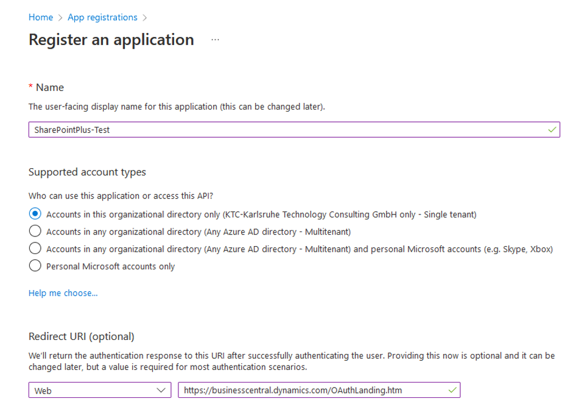
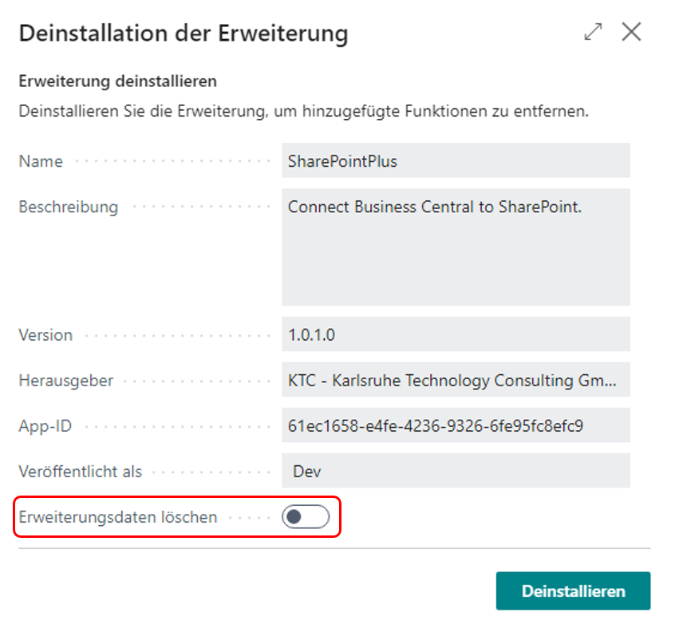
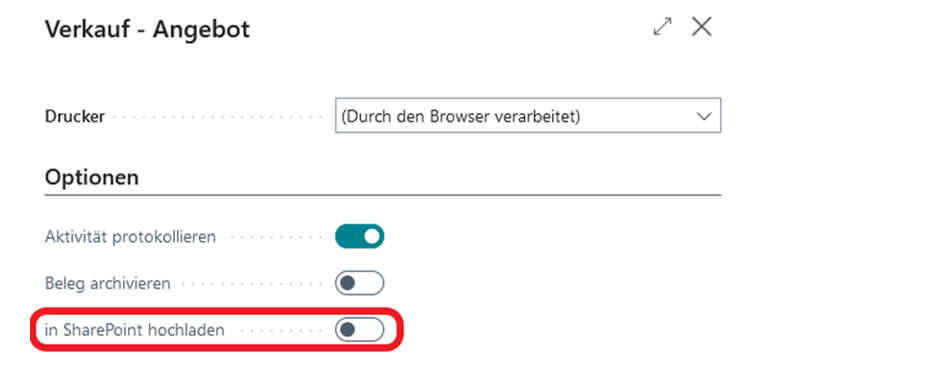

# SharePointPlus | Smart SharePoint Connector MS Business Central App V1.1

## Die SharePointPlus App

Die KTC SharePointPlus App ist eine zentrale Dateiverwaltung für Business Central. Verwalten und kategorisieren Sie Ihre Dateien direkt in Business Central. Laden Sie Dateien in SharePoint hoch und von SharePoint herunter, exportieren und importieren Sie Einstellungen in andere SharePoint-Anwendungen für identische Einstellungen in jedem Ihrer Systeme.
Dateien tagesgenau zum Kunden zuordnen wird mit der SharePointPlus App zum Kinderspiel.  Sie legen den Verbindungen an, die Anwendung ordnet sie automatisch den richtigen Ordnern beim richtigen Kunden zu.
Für jede Ebene von SharePointPlus können Sie individuell einstellen, wieviel wo angezeigt wird. Legen Sie für jede Liste einzeln fest, ob diese in SharePoint hochgeladen werden soll.

## Inhaltsverzeichnis

1. [Die SharePointPlus App](#die-sharepointplus-app)
2. [Ihre Vorteile](#ihre-vorteile)
3. [Ihr Mehrwert](#ihr-mehrwert)
4. [Mehrwert der SharePointPlus App](#mehrwert-der-sharepointplus-app)
5. [Azure AD Einrichtung](#azure-ad-einrichtung)
6. [Azure AD](#azure-ad)
7. [App-Registrierung](#app-registrierung)
8. [Api-Berechtigungen](#api-berechtigungen)
9. [Zertifikate und Geheimnisse](#zertifikate-und-geheimnisse)
10. [Installation und Lizenzmanagement](#installation-und-lizenzmanagement)
11. [Installation](#installation)
12. [Berechtigungen zur Installation einer Erweiterung](#berechtigungen-zur-installation-einer-erweiterung)
13. [Installation über den Marketplace](#installation-über-den-marketplace)
14. [Installation aus dem AppSource](#installation-aus-dem-appsource)
15. [Erweiterungsinstallation](#erweiterungsinstallation)
16. [Der Installationsfortschritt](#der-installationsfortschritt)
17. [Aufrufen der KTC Lizenz Management App](#aufrufen-der-ktc-lizenz-management-app)
18. [Initiales Einrichten der Lizenz Management App (Neukunden)](#initiales-einrichten-der-lizenz-management-app-neukunden)
19. [Initiales Einrichten der Lizenz Management App (Bestandskunden)](#initiales-einrichten-der-lizenz-management-app-bestandskunden)
20. [Ihr Installationsfortschritt](#ihr-installationsfortschritt)
21. [Passwort bei der KTC Lizenz Management App zurücksetzen](#passwort-bei-der-ktc-lizenz-management-app-zurücksetzen)
22. [Update der Anwendung](#update-der-anwendung)
23. [Deinstallation der Anwendung](#deinstallation-der-anwendung)
24. [Benutzerhandbuch – SharePointPlus App](#benutzerhandbuch-–-sharepointplus-app)
25. [Lizensierung](#lizensierung)
26. [Initiales Einrichten der Anwendung](#initiales-einrichten-der-anwendung)
27. [Aktivieren von SharePointPlus im aktuellen Mandanten](#aktivieren-von-sharepointplus-im-aktuellen-mandanten)
28. [Grundlagen](#grundlagen)
29. [SharePointPlus konfigurieren](#sharepointplus-konfigurieren)
30. [Allgemeine Informationen](#allgemeine-informationen)
31. [Einrichten der Dimensionen und Formatregeln](#einrichten-der-dimensionen-und-formatregeln)
32. [Verfügbare Seiten und Listen einrichten](#verfügbare-seiten-und-listen-einrichten)
33. [Filter festlegen](#filter-festlegen)
34. [Zugang freischalten und exportieren](#zugang-freischalten-und-exportieren)
35. [SharePointPlus in Business Central](#sharepointplus-in-business-central)
36. [Die Filterfunktion](#die-filterfunktion)
37. [Das SharePointPlus-Menü](#das-sharepointplus-menü)

## Ihre Vorteile

- Verwalten Sie Ihre Dateien direkt in Business Central
-Lassen Sie die Dateien automatisch hochladen
- Binden Sie SharePoint als Dokumentenmanagementsystem mithilfe von SharePointPlus direkt in Business Central an
- Behalten Sie den Überblick über alle Dokumente
- Ergänzen Sie automatisch Ihre Dateien durch die relevanten Metadaten wie Belegtyp, BelegID, ReferenzID, Dimension 1 und Dimension 2
- Kategorisieren Sie Ihre Dateien
- Sehen Sie den kompletten Schriftverkehr auf einen Blick
- Unterstützt werden die Sprachen: Deutsch, Englisch, Italienisch, Französisch, Niederländisch, Spanisch, Polnisch und Portugiesisch.

### Ihr Mehrwert  

Abb.1 Mehrwert durch die SharePointPlus App 

Abb.2 SharePointPlus im Einsatz 

## Mehrwert der SharePointPlus App

Folgende Funktionen bietet Ihnen die SharePointPlus App:

- Ablegen der Dokumente direkt in Microsoft SharePoint
- Automatisches anreichern der Dokumente mit Metadaten
  - DokumentenID – Die Nummer des Dokumentes
  - ReferenzID – Die Nummer des Debitors, Kreditors, Artikel, ….
  - DIM1 – übergeben der Dimensionswerte dieser Dimension
  - DIM2 – übergeben der Dimensionswerte dieser Dimension
- Zielgerichtete Ablage in unterschiedliche Bibliotheken und Listen (z.B.  Einkauf mit den Einkaufsbelegkategorien ist eine Bibliothek und Verkauf mit den zugehörigen Verkaufsbelegkategorien ist eine andere Bibliothek.)
- Unterteilen in Jahresordnern möglich
- Freie Konfiguration der Ansicht ob Liste oder Karte
- Filtern der SharePoint Ergebnisse anhand des aktuellen Business Central Filters (z.B. zeige nur die Dokumente, die zu dem aktuellen Kunden gehören)
- Unterschiedliche Berechtigungssätze für die Konfiguration (Administrator) und Benutzer.

Die Anwendung wurde mit ♥ in Karlsruhe, Deutschland entwickelt.

## Azure AD Einrichtung

### Azure AD

SharePointsPlus verwendet Azure AD für das Identitäts- und Zugriffsmanagement. Das bedeutet, dass Benutzer, die auf SharePointsPlus zugreifen, in Azure AD gespeichert und verwaltet werden.

### App-Registrierung

Um bei SharePointPlus die Authentifizierung zu nutzen, benötigt man eine App-Registrierung, die im Azure Portal angelegt werden muss.
Im Azure Portal geben Sie oben in der Suchleiste App-Registrierungen ein und klicken wie im Abbild zu sehen auf den Service „App-Registrierungen“

 
Abb.3 Azure Portal - App-Registrierung 

Als nächstes drücken Sie auf „Neue Registrierung“ und füllen dort einen beliebigen Anzeigenamen für die Anwendung aus. Kontotyp wird auf „einzelner Mandant“ gesetzt.
Die Umleitungs-URI setzen wir auf „Web“ und fügen diese URL hinzu:
<https://businesscentral.dynamics.com/OAuthLanding.htm> .
Anschließend kann die App registriert werden.

Abb.4 App-Registrierung 

### Api-Berechtigungen

Um die API ansprechen zu können, werden notwendige Berechtigungen benötigt.
Hierfür geben wir in der Suchleiste wieder „App-Registrierungen“ ein und wählen unsere neu erstellte App aus. Dort klicken wir dann in der Navigationsleiste (Links am Rand)
auf „API-Berechtigungen“.

Klicken Sie auf „Berechtigungen hinzufügen“ und wählen Sie „Microsoft Graph“ aus.
Dort wählen sie „Delegierte Berechtigungen“ aus und suchen nach „Files.ReadWrite.All“. Setzen Sie den Haken und geben als nächstes „Sites.ReadWrite.All“ ein. Setzen Sie auch dort einen Haken. Nun müssen Sie Berechtigungen hinzufügen“ auswählen und kontrollieren, ob diese übernommen wurden. Standardmäßig ist „User.Read“ schon hinzugefügt. Sollte dies nicht der Fall sein, fügen Sie diese Berechtigung hinzu.

 Abb.5 API Berechtigungen Übersicht 

Damit die Berechtigungen erteilt werden können, muss ein Admin sie freigeben. Ist dies erfolgt, steht der Status auf grün und die Berechtigungen wurden erteilt.

 Abb.6 Berechtigungen Endstatus 

### Zertifikate und Geheimnisse

Letzter Schritt ist die Generierung eines Secrets (Geheimniss), dieses wird später benötigt.

Hierfür klicken Sie in der Navigationsleiste auf Zertifikate & Geheimnisse und wählen „Neuer geheimer Clientschlüssel“ aus. Geben Sie diesem eine Beschreibung/Namen und legen Sie einen Zeitraum fest, zudem dieser geheime Schlüssel auslaufen soll. Klicken Sie dann auf „Hinzufügen“.

Wichtig: Kopieren Sie den neu erstellten geheimen Schlüssel und legen Sie ihn sicher (z.B. in einem Passwortmanager) ab. Der Schlüssel ist später nicht mehr sichtbar!

Abb.7 Secret-Generierung 

Die Azure AD Einrichtung ist jetzt abgeschlossen und Sie können mit der Installation beginnen.

## Installation und Lizenzmanagement

### Installation

Bitte beachten Sie, dass SharePointPlus erst ab Version 21.0 verfügbar ist. Dies bedeutet, dass Ihre Umgebung mindestens auf Version 21.0 aktualisiert sein muss, damit die SharePointPlus App bei Ihnen betriebsfähig ist.  

### Berechtigungen zur Installation einer Erweiterung

Ihr Unternehmensadministrator muss Ihnen in Business Central folgende Berechtigungen freigeben, um eine KTC-Extension in Ihrer Umgebung zu installieren: D365 EXTENSION MGT oder EXT MGT. -  ADMIN. Ihre Berechtigungen können Sie über den Punkt Benutzer nachvollziehen.

Abb.8 MS D365 BC - Berechtigungen 

### Installation über den Marketplace

Die KTC SharePointPlus App kann direkt in Business Central über den Microsoft AppSource installiert werden.
Geben Sie in der Suche Marketplace ein und wählen Sie den Marketplace für Erweiterungen aus.

 

Abb.9 Microsoft Marketplace für Erweiterungen (AppSource)

In der Suche des Marketplace geben Sie SharePointPlus ein und wählen die unten angezeigte App aus.

 

Abb.10 Marketplace SharePointPlus

Mit einem Klick auf Free Trial gelangen Sie in die Erweiterungsinstallation.

### Installation aus dem AppSource

Sie können die App auch direkt aus dem Microsoft AppSource installieren. Melden Sie sich hierfür im MS App Source an und suchen Sie nach der Erweiterung SharePointPlus.

 

Abb.11 SharePointPlus direkt im MS AppSource, Aufruf über den Browser

Auch in dieser Übersicht können Sie die Anwendung über den Button Free trial zu Ihrer Business Central Umgebung hinzufügen.
Nach Klick des Free trial-Buttons werden Sie an Ihr Dynamics 365 Business Central weitergeleitet. Es erscheint Ihnen ein Fenster, in dem Sie auswählen können, in welcher Umgebung Sie die Erweiterung installieren wollen.

 
Abb.12 Dynamics 365 Business Central – Auswahl der Umgebung 

Mit dem Klick auf Installieren werden Sie in die Erweiterungsinstallation weitergeleitet.

### Erweiterungsinstallation

In der Erweiterungsinstallation können Sie aus den verschiedenen Sprachen der SharePointPlus Erweiterung auswählen. Die unterstützen Sprachen sind: Deutsch, Englisch, Italienisch, Französisch, Niederländisch, Spanisch, Polnisch und Portugiesisch.
Falls Ihr BC in einer Sprache eingestellt ist, die nicht von SharePointPlus unterstützt wird, wird Ihnen die Erweiterung standardisiert auf Englisch installiert.

!<!---  Abb.13 Erweiterungsinstallation: Sprachauswahl und Installation 

Mit einem Klick auf Installieren wird Ihnen die Anwendung in Ihrer Umgebung installiert. Die Installation der App kann einige Minuten dauern. Sobald die Extension erfolgreich installiert wurde, erscheint Ihnen eine Meldung. Mit OK werden Sie zurück zum Startbildschirm geleitet.

### Der Installationsfortschritt

Um die erfolgreiche Installation oder den Installationsfortschritt von Erweiterungen zu sehen, geben Sie in der Suche Erweiterungsverwaltung ein und gehen Sie auf den entsprechenden Menüpunkt.
Über den Punkt Manage können Sie nun in die Ansicht des Installationsstatus kommen.

!<!---  Abb.14 Prüfen des Installationsstatus 

Eine Erweiterung ist vollständig installiert und betriebsbereit, wenn der Status abgeschlossen ist.

 Abb.15 Installationsstatus: abgeschlossen 

### Aufrufen der KTC Lizenz Management App

Sollten Sie die KTC Lizenz Management App noch nicht besitzen, wird diese zusammen mit SharePointPlus installiert. Diese App stellt die Verbindung zum Lizenzserver her und lässt Sie die verfügbaren Lizenzen abrufen und verwalten.
Wichtig: Bitte beachten Sie, dass SharePointPlus ohne die Lizenzverwaltung nicht betriebsfähig ist. Bevor die SharePointPlus App gestartet werden kann, muss die KTC Lizenz Management App eingerichtet werden.
Wichtig: Um die KTC Lizenz Management App aufrufen zu können benötigen Sie die SUPER oder SPP LIC LICENCE USER KTC Rechte.
Zum Öffnen der Lizenzverwaltung geben Sie in der Suche „KTC Liz“ ein und wählen Sie die App KTC Lizenz Management aus.

 Abb.16 Aufrufen der KTC Lizenz Management App 

### Initiales Einrichten der Lizenz Management App (Neukunden)

Um SharePointPlus als Neukunde unserer Programme zu nutzen, öffnen Sie bitte zuerst das KTC Lizenz Management. Das Programm wird automatisch mitinstalliert, sobald Sie SharePointPlus aus dem AppSource bezogen haben. Geben Sie hierfür Lizenz in die Suchmaske ein und wählen das Verwaltungsprogramm KTC Lizenz Management aus.

 Abb.17 Aufrufen der Lizenzverwaltung 

Beim initialen Aufruf der KTC Lizenz Management App ist Ihre Tennant ID noch nicht gesetzt. Diese wird im nächsten Schritt automatisch ermittelt und gesetzt.

 Abb.18 Einrichten der KTC Lizenz Management Erweiterung 

Starten Sie den Einrichtungsassistent und geben bitte Ihren Firmennamen und Ihre E-Mail-Adresse ein. Alle Erweiterungen der KTC werden diesem Firmennamen und dieser E-Mail-Adresse zugeordnet.
Achtung: Sie benötigen diese E-Mail-Adresse zur Wiederherstellung der Zugangsdaten. Zu Abrechnungszwecken kann später eine weitere E-Mail-Adresse hinterlegt werden.
Bitte lesen Sie den Lizenzvertrag und bestätigen Sie, dass sie diesen gelesen und akzeptiert haben.

 

Abb.19 Der KTC Lizenz Einrichtungs-Assistent

Danach bestätigen Sie weiter. Wir generieren jetzt ein Passwort für Sie, mit dem Sie sich in der Lizenzverwaltung anmelden können. Bitte speichern Sie dieses Passwort gesondert ab. KTC speichert Ihre Passwörter nicht.
Achtung: Bitte speichern Sie sich Ihre Anmeldeinformationen gesondert ab. Sollten Sie Ihr Passwort vergessen oder verlieren, wird Ihnen an die angegebene E-Mail ein neues zugesendet. Die Lizenz Management-Anwendung sichert Ihre Informationen nicht.

 

Abb.20 KTC Lizenz Management Passwort (Lizenzschlüssel)

Mit einem Klick auf OK werden die Informationen hinterlegt. Klicken Sie im nächsten Fenster auf fertig, um die Einrichtung fertigzustellen. Die Erweiterung SharePointPlus erscheint nun automatisch in der Übersicht der über KTC lizenzierten Anwendungen auf.
Hinweis: Aus Sicherheitsgründen speichern wir Ihr Passwort nicht. Bitte speichern Sie sich Ihr Passwort gesondert ab. Sie benötigen Ihr Passwort, wenn Sie den Lizenz Manager in weiteren Environments wie etwa Sandboxes installieren möchten (z.B. mehrfach Installation in unterschiedlichen Tennants mit der gleichen Tennant-ID). Vergessene Passwörter werden systemseitig immer durch neue Passwörter ersetzt.

### Initiales Einrichten der Lizenz Management App (Bestandskunden)

Da Sie bereits eine KTC-Extension installiert haben, sind Sie bereits für die KTC Lizenz Management App registriert.  Dementsprechend besitzen Sie bereits einen Zugang.
Um die Installation der SharePointPlus Extension abzuschließen, öffnen Sie den Einrichtungsassistenten der KTC Lizenzmanagement App (z.B. über die Suche -> KTC Lizenz Management).

Abb.21 wiederholtes Einrichten der KTC Lizenz Management über den Einrichtungsassistenten 

Nach öffnen des Einrichtungsassistenten geben Sie bitte Ihre bereits vorhandenen Zugangsdaten ein, damit Sie die neue Extension auf Ihren Tenant installieren können. Ihre Tenant-ID wird automatisch für Sie ausgefüllt, Sie müssen also nur noch Ihre E-Mail und das Passwort ausfüllen. Sollten Sie Ihr Passwort vergessen haben, können Sie über „Passwort vergessen?“ ein Neues anfordern (vgl. Passwort bei der KTC Lizenz Management App ).

Abb.22 wiederholtes Einrichten der KTC Lizenz Management App 

Bitte gehen Sie anschließend auf Weiter. Die Einrichtung der KTC Lizenz Management App ist nun abgeschlossen. Es werden automatisch alle gültigen und verfügbaren KTC-Lizenzen vom KTC-Lizenzserver importiert.
Die SharePointPlus App ist nun fertig installiert und erscheint in Ihrer Lizenzübersicht.

### Ihr Installationsfortschritt

Um den Installationsfortschritt von Erweiterungen zu sehen, geben Sie in der Suche Erweiterungsverwaltung ein und wählen die zu beobachtende Erweiterung aus. (z.B. SharePointPlus).

 Abb.23 Prüfen des Bereitstellungsstatus 

Eine Erweiterung ist vollständig installiert und betriebsbereit, wenn der Status abgeschlossen ist.

### Passwort bei der KTC Lizenz Management App zurücksetzen

Über die Funktion Passwort vergessen? Können Sie sich ein neues Passwort (= Lizenzschlüssel) generieren lassen. Es wird ein neuer Tab geöffnet, in dem Sie die E-Mail-Adresse, die mit der Lizenz verlinkt ist, eingeben und auf Absenden klicken.

 

 Abb.24 zurücksetzen des Passwortes (Lizenzschlüssel)

An diese E-Mailadresse wird ein Link versendet. Klicken Sie auf den Link, um das neue Passwort zu erhalten. Bitte speichern Sie sich dieses gesondert ab. Das alte Passwort verliert dadurch seine Gültigkeit.

Abb.25 Neues Passwort (Lizenzschlüssel) erhalten 

### Update der Anwendung

Die Anwendung wird über das Microsoft Dynamics 365 Business Central Admin Center aktualisiert. Die KTC Lizenz Management App zeigt Ihnen zusätzlich an ob neue Versionen der KTC-Erweiterungen vorliegen.

 Abb.26 Das Microsoft Dynamics 365 Business Central Admin Portal öffnen 

Um Ihre App-Übersicht zu öffnen, gehen Sie über Environments -> manage apps auf eine Liste der installierten Anwendungen. In dieser Liste werden Ihnen unter anderem die installierte Version und die Information, ob „Ihre“ Version auch die aktuelle ist <!---(vgl. Abb.23) .

 Abb.27 Auswahl der Umgebung im Dynamics 365 Business Central Admin Center 

Falls nötig, können Sie hier unsere Anwendung auf den neuesten Stand updaten. Dazu müssen Sie zunächst die Erweiterung auswählen, die Sie updaten möchten.
Gehen Sie hierfür auf Apps -> Manage Apps -> Update. Die Anwendungen KTC Lizenz Management und SharePointPlus werden jetzt auf den neuesten Stand gebracht. Sobald die Aktualisierung abgeschlossen ist, können Sie das Admin Center verlassen und mit den Anwendungen in Ihrer Business Central-Umgebung weiterarbeiten.

### Deinstallation der Anwendung

Geben Sie in der Suche der Business Central Aktivitätenübersicht Erweiterung ein und wählen Sie die Erweiterungsverwaltung aus.
Suchen Sie nach der zu löschenden App und gehen Sie über die drei Punkte in die Verwaltung. Wählen Sie den Menüpunkt deinstallieren.
Alternativ können Sie auch die App auswählen und über den Menüpunkt Manage den Punkt deinstallieren auswählen.

 Abb.28 Erweiterungsverwaltung: Deinstallation 

Im nächsten Fenster haben Sie die Wahl, ob Sie die Anwendung nur deinstallieren wollen, oder ob Sie die beinhalteten Daten auch löschen wollen. Wenn Sie die App nur deinstallieren wollen, lassen Sie den Button Erweiterungsdaten löschen unangetastet. Falls Sie alle Daten löschen wollen, betätigen Sie den Button Erweiterungsdaten löschen.

 Abb.29  Erweiterungsdaten löschen 

Sie können nach ihrer Auswahl die App deinstallieren. Nun müssen Sie einige Sekunden bis Minuten warten. Die Anwendung wird aus Ihrem System und der Auflistung entfernt. Nach erfolgreicher Deinstallation wird Ihnen ein entsprechendes Fenster angezeigt.
Hinweis: Wird das KTC Licence Management deinstalliert, ist die Nutzung der SharePointPlus-Erweiterung sowie anderer unserer Produkte nicht mehr möglich.

### Benutzerhandbuch – SharePointPlus App

## Lizensierung

Die SharePointPlus App stellt verschiedene Lizenzen zur Verfügung. Die Lizensierung erfolgt über die mitinstallierte KTC Lizenz Management App (vgl.Passwort bei der KTC Lizenz Management App zurücksetzen).
Wenn Sie im Marketplace oder im MS AppSource die SharePointPlus App herunterladen und installieren, erhalten Sie automatisch eine 30-tägige Testlizenz.
Nach Ablauf der Lizenz, um SharePointPlus weiterhin nutzen zu können, kontaktieren Sie uns per Mail an Anfrage.D365BC-Apps@ktc.de, mit der Information über die Anzahl Ihrer User. Die aktuellen Preise der SharePointPlus App können Sie dem SharePointPlus Flyer entnehmen.
Um die SharePointPlus App nutzen zu können, benötigen Sie die SPP LIC User KTC.

## Initiales Einrichten der Anwendung

Wichtig: Um die Einrichtungsseite der SharePointPlus App aufrufen zu können, benötigen Sie die SUPER oder SPP ADMIN KTC Rechte. Um die SharePointPlus App nutzen zu können, benötigen Sie entweder die Testlizenz oder eine gekaufte Lizenz. Die Rechte, die Sie mit den Lizenzen erhalten, heißen SPP LIC User KTC.

## Aktivieren von SharePointPlus im aktuellen Mandanten

Sie können die SharePointPlus App für jeden Mandanten einzeln aktivieren oder deaktivieren. Um die SharePointPlus App zu aktiveren suchen Sie im aktuellen Mandanten nach der Einrichtungsseite „SharePointPlus Setup“.

 Abb.30 SharePointPlus aktivieren und/oder konfigurieren

Bitte aktivieren Sie SharePoint Plus durch das Aktivieren des Schalters.

 Abb.31 SharePointPlus im aktiven Mandanten aktivieren 

## Grundlagen

Der Grundgedanke der SharePointPlus App ist das automatisierte hochladen der in Microsoft Dynamics 365 Business Central generierten Belege. Diese Belege werden mit den in Business Central vorgegebenen Zusatzinformationen (Metadaten) angereichert. Folgende Zusatzinformationen werden aktuell an Microsoft SharePoint übergeben.

 Abb.32 SharePointPlus im Einsatz 

Hinweis: Sie benötigen zusätzlich zu dieser App die Microsoft SharePoint Lizenzen. Diese sind in dieser App nicht enthalten.

## SharePointPlus konfigurieren

Rufen Sie erneut die Seite SharePointPlus Setup auf <!---vgl. (Abb. 25: SharePointPlus aktivieren und/oder konfigurieren). Nach dem diese aktiviert wurde sehen Sie jetzt die Konfigurationsseite der Anwendung.
Der Benutzer, der die Konfigurationsseite aufruft, benötigt folgende Berechtigungen:

- SPP Admin KTC – Berechtigungssatz für den Administrator
- SPP LIC User KTC – Lizenzberechtigung für SharePointPlus

Die Konfigurationsseite ist thematisch gruppiert.

## Allgemeine Informationen

 

Abb.33 Allgemeine Informationen – Verbindung zu Ihrem SharePoint 

In der Abbildung sehen Sie einen Ausschnitt der Setup-Seite. Sobald Sie Ihre Informationen eingefügt haben, werden diese im System hinterlegt.
Klicken Sie jetzt auf Zugangsberechtigung erstellen. Dadurch wird ein Access Token generiert, der Ihnen der Ihnen den Zugriff auf Microsoft SharePoint ermöglicht.
Hinweis: In Microsoft SharePoint benötigen Sie entsprechende Rechte auf die Bibliotheken, Listen und Dokumente.

## Einrichten der Dimensionen und Formatregeln

In der folgenden Dimensionsmaske können Sie zwei Dimensionscodes festlegen, mithilfe derer Ihre Dateien sortiert werden. Mit Dimensionen können Sie außerdem vom System Auswertungen über die verknüpften Inhalte erstellen lassen. Wählen Sie hier aus Ihrer vorher eingepflegten Liste. Fehlende Dimensionen und ihre Codes müssen Sie über die Dimensionsverwaltung festlegen, bevor diese von SharePointPlus genutzt werden können.

Abb.34 Zuordnung der zu übergebenden Dimensionen an SharePoint 

Hier soll angemerkt sein, dass SharePointPlus mit vier zentralen Dimensionen arbeitet: DIM1 und DIM2, die Sie hier festlegen können, sowie die Dokumenten-ID (doc.id), die die Dateien voneinander unterscheidbar machen.
DIM1 und DIM2 können Sie aus allen in Business Central hinterlegten Dimensionen frei gewählt werden.

Doc.ref ist eine Dimension, die von Business Central definiert wird. Sie brauchen Sie bei der Einrichtung von SharePointPlus nicht berücksichtigen.

Die vierte Dimension ist die ref.ID, also die Identifikation der Referenz zwischen den Dokumenten. Was die ref.ID von den anderen unterscheidet ist der Umstand, dass die ref.ID im Gegensatz zu den ersten drei nicht global vergeben wird.

Die globalen Metadaten werden vom System vorgegeben und ausgewertet, und können daher nur globale Auswertungen durchführen. Die ref.ID arbeitet hingegen auf Zeilenebene, was eine genauere Statistik ermöglicht.

Eine weitere Dimension ist die Doc.id. Diese ist immer die Nummernserie, die ein Dokument von den anderen unterscheidet. Diese müssen Sie nicht weiter definieren.

Gelegentlich wird Ihnen noch die Dimension DocType angezeigt werden. Diese wird automatisch erstellt und bezeichnet den Dokumententyp. So können in der Auswertung dann Bestellungen von Verkäufen unterschieden werden.

 Abb.35 Festlegen des Dateiformats für das SharePoint Dokument 

Im Anschluss definieren Sie das standardisierte Format, mit dem SharePointPlus arbeiten soll. Zunächst legen Sie Ihr gewünschtes Datumsformat fest, danach das Trennzeichen, mit dem Sie die Teilinformationen voneinander abspalten möchten. Ein Dateiname kann so beispielsweise folgende Form annehmen:
Beispiel: YYYY-DD-MM – (Bindestrich) → 2022-21-10 – UserManual.pdf

### Verfügbare Seiten und Listen einrichten

Hier werden Seiten und Listen eingerichtet, die mithilfe von SharePointPlus verwaltet werden sollen.

 Abb.36 : Mit vorhandenen SharePoint Bibliotheken verbinden 

Hinweis: Bitte beachten Sie, dass Sie SharePointPlus erst aktivieren, Ihre Informationen ergänzen und eine Zugangsberechtigung erstellen müssen, um die folgenden Punkte bearbeiten zu können. Ohne eine gültige Zugangsberechtigung werden Ihnen die unten dargestellten Optionen nur zum Teil oder gar nicht angezeigt, wodurch SharePointPlus nicht angemessen konfiguriert und so auch nur bedingt genutzt werden kann.
Wählen Sie hier zunächst die Seite aus, die Sie verwalten lassen wollen. Die URL wird automatisch vom System ergänzt, da diese schon in der zugehörigen Kartei hinterlegt sein sollte.
Diese Einstellung ist dringend vorzunehmen, da Sie auf diesen Seiten sonst nicht auf die Funktionen von SharePointPlus zugreifen können. Die Seiten, auf die Sie mit SharePointPlus zugreifen können, werden von Business Central vorgegeben. Sie können hier nichts addieren oder entfernen. Möchten Sie bestimmte Seiten nicht nutzen, wählen Sie diese hier nicht aus.
In der Listenordnung werden die Systeme konfiguriert, in die Ihre Tabellen und Seiten eingefügt werden sollen. Die können Ihre Unterlagen nicht direkt auf der vorher gewählten Website hochladen; diese müssen zunächst in Listen eingepflegt werden, die Sie dann mit SharePointPlus verwalten können. Diese Listen sind mit Tabellennummer, -Name und verknüpften Dokumententyp versehen.

 Abb.37 : Seitenbezogenes festlegen der anzuzeigenden SharePoint Listen 

Bitte beachten Sie, dass Dokumententyp sich hier auf den Inhalt des Dokuments bezieht, nicht auf die Datei Art. Auch können Sie hier nur bereits in SharePoint eingerichtete Seiten, Listen und Bibliotheken hinzufügen.
Eine vollständig fehlende Option muss über SharePoint selbst eingerichtet werden, bevor SharePointPlus auf sie zugreifen kann.
Den gewählten Tabellen müssen Sie mindestens eine Bibliothek zuweisen, die zur Verwaltung genutzt werden soll.
Geben Sie hier einen Quell- und Uploadordner an. Diese helfen dabei, die Dokumente zu strukturieren und zu sortieren. Wenn Sie diese Ordner auch in der SharePointPlus-Oberfläche sehen möchten, klicken Sie hier auf Ordner anzeigen.

 Abb.38 : Listen der ausgewählten SharePoint Bibliothek hinzufügen 

Mit einem Klick auf in SharePoint hochladen AN werden die hier erfassten Unterlagen direkt in Ihre SharePoint-Umgebung integriert.

Hinweis: Bitte beachten Sie, dass immer nur eine Liste mit einem automatischen Upload markiert werden kann. Wählen Sie hier eine Liste aus, so wird die Funktion für alle anderen automatisch deaktiviert.

 Abb.39 : Quellordner pro Liste festlegen 

Wählen Sie hier einen der hinterlegten Quellordner aus, sofern diese im SharePointPlus-Interface hinterlegt werden sollen. Wählen Sie hier nichts aus, so wird in SharePointPlus lediglich der Listentitel und die darin enthaltenen Dateien angezeigt. Haben Sie den richtigen Quellordner eingerichtet, bestätigen Sie Ihre Auswahl mit OK, um zurück zum Setup zu gelangen.

## Filter festlegen

In der Bibliotheksauswahl können Sie den enthaltenen Listen über die drei Punkte -> Filter Mapping den Listeninhalten Filter zuordnen.

 Abb.40 : Auswahl der SharePoint Listen 

Wählen Sie in der Übersicht hierfür ein Business Central-Feld und eine SharePoint-Spalte aus. Die zur Auswahl stehenden Spalten sind vom ausgewählten Feld abhängig. Das Feld aus Business Central können Sie frei wählen. Für jede Liste können Sie einen Filter festlegen.
Die Konfiguration der Filter ist völlig optional. Wenn Sie hier nichts einstellen, wird Ihnen in der SharePointPlus-Oberfläche stets der gesamte Listeninhalt angezeigt.
Klicken Sie auf den Pfeil oben links oder drücken Sie Esc, um zur Bibliotheksauswahl zurückzukehren.
Mit OK speichern Sie die Einstellungen für die aktuelle Liste.

 Abb.41 : Zuordnen der Metadaten

! Abb.42 : Hinzufügen der Bibliotheken 

Mit aktuellem Jahr benutzen wird ein neuer Ordner zur Sortierung Ihrer Unterlagen erstellt. In diesen werden die Unterlagen durch das in 5.2.2 vorgegebene Format in den richtigen Jahresordner sortiert. So können Sie Dateien aus unterschiedlichen Jahren ohne Probleme verwalten lassen.
Wünschen Sie, dass der Jahresordner nicht in Ihrer SharePointPlus-Umgebung angezeigt wird, entfernen Sie hier den Haken unter Ordnerjahr anzeigen. Ist diese Funktion deaktiviert, sehen Sie in der SharePointPlus-Oberfläche nur die Bibliotheken und die darin enthaltenen Dateien. Möchten Sie die Unterlagen nach den Daten sortiert anzeigen lassen, aktivieren Sie den Haken hier.
In dieser Übersicht können Sie sämtliche Haken beliebig an- und abwählen. Sie beeinflussen nur das Verhalten von SharePointPlus in Bezug auf die spezielle Liste. Sie verändern sich nicht untereinander.
Über DocRef können Sie Metadaten festlegen, die nur für die in der Liste enthaltenen Dokumente genutzt werden. Wählen Sie auch hier aus der vorgefertigten Liste aus. Sollten Ihnen Dimensionen fehlen, können Sie diese über die Dimensionsverwaltung in Business Central hinzufügen. Mit dem nächsten Update werden die Informationen im SharePointPlus-Setup angelegt.
Wenn Sie eine DocRef festgelegt haben, können Sie mit einem Haken bei Filter Dokument dafür sorgen, dass diese Liste nur noch in gefilterter Form in SharePointPlus angezeigt wird. Setzen Sie diesen Haken nicht, werden in der SharePointPlus-Oberfläche alle Dokumente der Liste angezeigt. Bitte beachten Sie, dass Sie die Liste nicht filtern lassen können, wenn Sie keine DocRef definiert haben. Diese Einstellung beeinflusst nur das Verhalten dieser einen Liste. Sie können auch bei der Bibliotheksauswahl einen Filter definieren und dann hier entscheiden, die Liste ungefiltert anzeigen zu lassen.
Alle anderen Felder werden automatisch von SharePointPlus angelegt, sofern die notwendigen Informationen in den Auswahlmöglichkeiten hinterlegt wurden.

## Zugang freischalten und exportieren

Zur Nutzung von SharePointPlus benötigen Sie Berechtigungen, die über die Rollen und Rechte von Business Central hinausgehen.

 Abb.43 : Zugangsberechtigungen (Access-Token) 

Mit Zugangsberechtigung erstellen wird ein einmaliger Access Token erstellt, mit dem Sie SharePointPlus an SharePoint und Business Central anbinden und die Programme gemeinsam nutzen können. Solche Tokens sind von Natur aus nur für eine bestimmte, kurze Zeit gültig. Daher können Sie bei Bedarf die Lebensdauer der Berechtigung mit Zugangsberechtigung aktualisieren verlängern.
Mit dieser Funktion können Sie Ihre vorgenommenen Einstellungen in einer Datei speichern, um diese weiterzugeben. Sinnvoll ist dies, wenn alle Ihrer Mitarbeitenden mit denselben Einstellungen in der gleichen Lizenz und dem gleichen Aufbau der Anwendung arbeiten sollen. So können Sie fehlerhafte oder fehlende Sortierungen durch unregelmäßige Einstellungen der einzelnen Nutzenden vermeiden.
Der Export speichert die Informationen in einer Datei zum Download sowie zur Weitergabe, der Import biete die Möglichkeit, eine bereits vorhandene Einstellungsdatei ins SharePointPlus-Setup einzubinden, um Einstellungen aus einer anderen Version zu kopieren.

 Abb.44 : Konfiguratione Speichern und Laden 

## SharePointPlus in Business Central

Über Verkauf -> Verkaufsangebote in Business Central kommen Sie in eine Übersicht aller Ihrer laufenden Verkaufsangebote. Mit SharePointPlus können Sie direkt in dieser Übersicht auf die zugehörigen Dokumente zugreifen.

 Abb.45 : SharePointPlus in der Listenansicht von Verkaufsangeboten 

Hinweis: Bitte beachten Sie, dass Sie den Infoboxbereich hierfür erweitern müssen. Die SharePointPlus-Oberfläche wird nur innerhalb des Infoboxbereiches angezeigt.
Die Dateien, die mit dem ausgewählten Kunden verknüpft sind, werden hier seitlich angezeigt. Die Dateien werden nach Ihren in der Installation definierten Einstellungen sortiert. So haben Sie alles auf einen Blick.

## Die Filterfunktion

In der oberen linken Ecke der SharePointPlus-Oberfläche finden Sie ein kleines Trichtericon, wenn Sie für die abgerufenen Listen Filter eingerichtet hatten, als Sie SharePointPlus eingerichtet hatten. Dieses Icon dient nur zu Ihrer Information. Wird es nicht angezeigt, wurde für die Liste kein Filter eingerichtet.
Die Filterfunktion wird automatisch im Hintergrund angewendet, wenn Sie einen Filter eingerichtet und die Funktion aktiviert haben. Sie brauchen in SharePointPlus nichts weiteres anwählen.
Die eingerichteten Filter gleichen den Feldnamen in Business Central mit den Spaltennamen in SharePoint ab.

## Das SharePointPlus-Menü

Bestimmte Listen und Ordner können Sie hier nach Ihren Bedürfnissen auf- beziehungsweise zuklappen, damit Sie die Dokumente möglichst einfach navigieren können. Durch einen Klick auf SharePoint Plus öffnet sich ein Drop-Down-Menü, mit dem Sie verschiedene Aktionen in SharePointPlus ausführen können.

!<!---  Abb.46 : Das SharePointPlus Menu 

Mit Zugangsberechtigung erstellen können Sie, wie im Setup der Anwendung auch, einen neuen Zugang für den aktuellen Nutzer erstellen und gegebenenfalls aktualisieren. Eventuell ist hierfür eine erneute Anmeldung des Nutzenden vonnöten.
Mithilfe von SharePoint Einstellungen können Sie die Einrichtungsseite aus 5.2 aufrufen, um kurzfristige Änderungen an den Einstellungen vorzunehmen. Beispielsweise können Sie hier Ihren Listen weitere Bibliotheken hinzufügen, sowie kleinere Anzeigeeinstellungen anpassen.
Mit Dokument neu laden wird die Ansicht von SharePointPlus aktualisiert. Das kann nützlich sein, wenn Sie in den Einstellungen Änderungen vorgenommen haben.
Über Datei hochladen können Sie der Ansicht weitere Dateien hinzufügen. Es kann einige Zeit dauern, bis das Dokument von SharePointPlus verarbeitet und korrekt abgelegt wurde. Dies ist kein Grund zur Sorge.
In Excel öffnen lädt eine Datei des Dokumentes auf Ihren PC, mit der Sie die Übersicht in Excel öffnen können. Diese Datei ist automatisch eine schreibgeschützte Kopie; in der Oberfläche von Excel können Sie die Bearbeitung allerdings aktivieren.
Hier finden Sie jetzt auch die neue Funktion in SharePoint hochladen. Wenn Sie diese Taste betätigen, werden die jeweiligen Belege (also entweder alle oder nur die gefilterten) gleichzeitig in SharePoint hochgeladen. So müssen Sie sie nicht manuell dort verknüpfen, sondern können mehrere Aktionen in einem Schritt erledigen.
Wenn Sie Filter eingerichtet haben, die Sie jetzt aber nicht nutzen möchten, können Sie diese über Filter ein-/ausschalten deaktivieren. Die Listen werden im Hintergrund immer noch gefiltert, für Sie angezeigt werden aber alle Dateien der Liste.
Mit SharePointPlus verwaltete Dokumente können Sie natürlich auch über die übliche Weise in SharePoint hochladen und dort abrufen. SharePointPlus übernimmt lediglich die Sortierung und die direkte Anbindung Ihrer SharePoint-Dokumente in Ihrer Angebotsauflistung.
Mit Drucken in der Aufgabenliste über Ihrer Ansicht können Sie die ausgewählte Tabelle drucken oder versenden. Ferner können Sie hier Ihre Auswahl filtern, so dass beispielsweise nur die Verkaufsangebote gedruckt werden.

 Abb.47 : Beleg durch Auswahl im Druckdialog zu SharePoint hochladen. 
