# SharePointPlus | Smart SharePoint Connector MS Business Central App V1.1

## The SharePointPlus app

The KTC SharePointPlus App is a central file management for Business Central. Manage and categorize your files directly in Business Central. Upload and download files to and from SharePoint, export and import settings to other SharePoint applications for identical settings in each of your systems.
Assigning files to clients on a daily basis becomes a breeze with the SharePointPlus app.  You create the connections, the app automatically maps them to the right folders at the right customer.
For each level of SharePointPlus, you can individually set how much is displayed where. Specify for each list individually whether it should be uploaded to SharePoint.

## Table of content

1. [The SharePointPlus app](#the-sharepointplus-app)
2. [Your benefits](#your-benefits)
3. [Your added value](#your-added-value)
4. [Added value of the SharePointPlus App](#added-value-of-the-sharepointplus-app)
5. [Azure AD setup](#azure-ad-setup)
6. [Azure AD](#azure-ad)
7. [App registration](#app-registration)
8. [Api permissions](#api-permissions)
9. [Certificates and secrets](#certificates-and-secrets)
10. [Installation and license management](#installation-and-license-management)
11. [Installation](#installation)
12. [Permissions to install an extension](#permissions-to-install-an-extension)
13. [Installation via the Marketplace](#installation-via-the-marketplace)
14. [Installing from the AppSource](#installing-from-the-appsource)
15. [Extension installation](#extension-installation)
16. [Installation progress](#installation-progress)
17. [Accessing the KTC License Management App](#accessing-the-ktc-license-management-app)
18. [Initial Setup of the License Management App (New Customers)](#initial-setup-of-the-license-management-app-new-customers)
19. [Initial Setup of the License Management App ( Existing Customers)](#initial-setup-of-the-license-management-app-existing-customers)
20. [Your Installation progress](#your-installation-progress)
21. [Reset password at KTC License Management App](#reset-password-at-ktc-license-management-app)
22. [Update the application](#update-the-application)
23. [Uninstall the application](#uninstall-the-application)
24. [User manual - SharePointPlus App](#user-manual---sharepointplus-app)
25. [Licensing](#licensing)
26. [Initial setup of the application](#initial-setup-of-the-application)
27. [Activate SharePointPlus in the current client](#activate-sharepointplus-in-the-current-client)
28. [The Basics](#the-basics)
29. [Configure SharePointPlus](#configure-sharepointplus)
30. [General Information](#general-information)
31. [Setting up the dimensions and format rules](#setting-up-the-dimensions-and-format-rules)
32. [Set up available pages and lists](#set-up-available-pages-and-lists)
33. [Set filters](#set-filters)
34. [Activate access and export](#activate-access-and-export)
35. [SharePointPlus in Business Central](#sharepointplus-in-business-central)
36. [The filter function](#the-filter-function)
37. [The SharePointPlus menu](#the-sharepointplus-menu)

## Your benefits

- Manage your files directly in Business Central
- Have the files uploaded automatically
- Integrate SharePoint as a document management system directly in Business Central using SharePointPlus
- Keep track of all documents
- Automatically add relevant metadata to your files such as document type, document ID, reference ID, dimension 1 and dimension 2
- Categorize your files
- See all correspondence at a glance
- Supported languages: English, German, Italian, French, Dutch, Spanish, Polish and Portuguese.

## Your added value  

Fig.1 Added value through the SharePointPlus App

Fig.2 SharePointPlus in use 

### Added value of the SharePointPlus App

The SharePointPlus App offers the following functions:

- Storage of documents directly in Microsoft SharePoint
- Automatic enrichment of documents with metadata
  - DocumentID - The number of the document
  - ReferenceID - the number of the customer, vendor, article, ....
  - DIM1 - pass the dimension values of this dimension
  - DIM2 - transfer the dimension values of this dimension
- Targeted storage in different libraries and lists (e.g. Purchasing with the purchasing document categories is one library and Sales with the related sales document categories is another library).
- Subdivision into annual folders possible
- Free configuration of the view whether list or map
- Filtering of SharePoint results based on the current Business Central filter (e.g. show only documents belonging to the current customer)
- Different permission sets for configuration (administrator) and users.

The application was developed with ♥ in Karlsruhe, Germany.

## Azure AD setup

### Azure AD

SharePointsPlus uses Azure AD for identity and access management. This means that users accessing SharePointsPlus are stored and managed in Azure AD.

### App registration

In order to use authentication with SharePointPlus, you need an App Registration, which must be created in the Azure Portal.
In Azure Portal, enter App Registrations in the search bar at the top and click on the "App Registrations" service as shown in the screenshot.

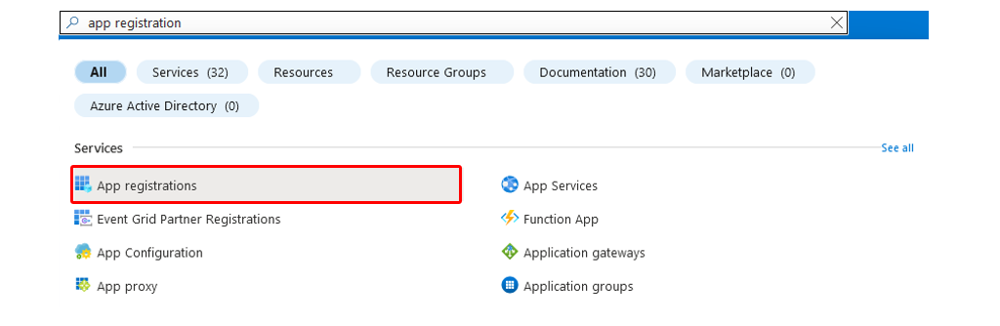
Fig.3 Azure Portal - App Registration 

Next, press "New Registration" and fill in any display name for the application there. Account type is set to "single client".
We set the redirect URI to "web" and add this URL:
<https://businesscentral.dynamics.com/OAuthLanding.htm> .
After that, the app can be registered.

Fig.4 App registration 

### Api permissions

In order to be able to access the API, necessary permissions are required.
For this, we enter "App Registrations" again in the search bar and select our newly created app. Then we click on "API permissions" in the navigation bar (left margin).
on "API Permissions."

Click on "Add Permissions" and select "Microsoft Graph."
There, they select "Delegated Permissions" and look for "Files.ReadWrite.All." Check the box and next enter "Sites.ReadWrite.All." Put a check mark there as well. Now you need to select "Add Permissions" and check that they have been applied. By default, "User.Read" is already added. If this is not the case, add this permission.

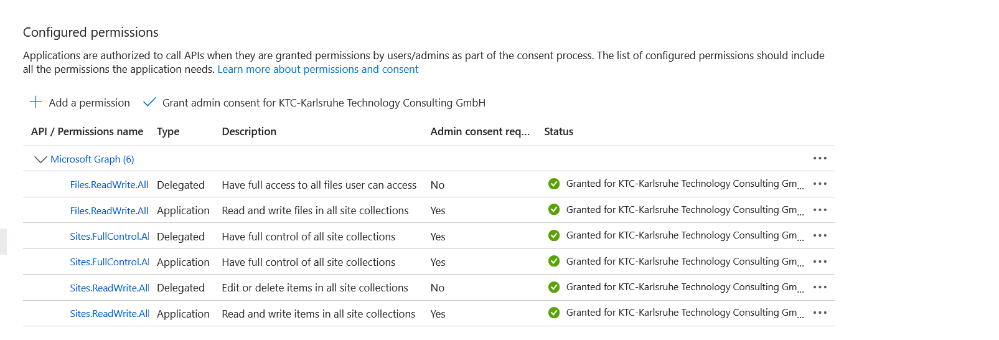 Fig.5 API Permissions Overview 

In order for the permissions to be granted, an admin must approve them. Once this is done, the status is green and the permissions have been granted.

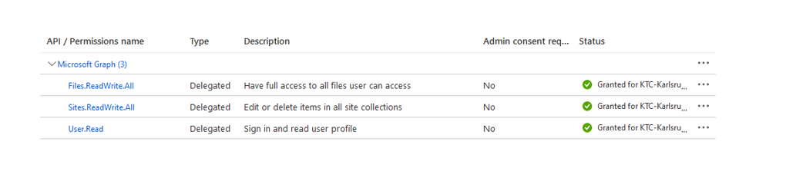 Fig.6 Permissions final status 

### Certificates and secrets

The last step is the generation of a secret, which will be needed later.

To do this, click on Certificates & Secrets in the navigation bar and select "New secret client key". Give it a description/name and set a time period when this secret key should expire. Then click on "Add".

Important: Copy the newly created secret key and store it securely (e.g. in a password manager). The key will no longer be visible later!

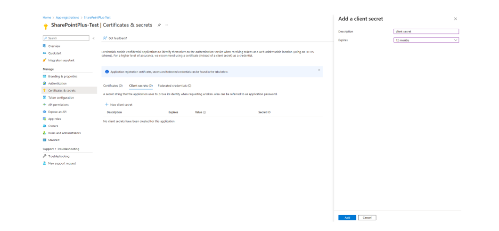
Fig.7 Secret generation 

The Azure AD setup is now complete and you can start the installation.

## Installation and license management

### Installation

Please note that SharePointPlus is only available from version 21.0. This means that your environment must be updated to at least version 21.0 for the SharePointPlus app to be operational at your site.  

### Permissions to install an extension

Your company administrator must grant you the following permissions in Business Central to install a KTC extension in your environment: D365 EXTENSION MGT or EXT MGT. - ADMIN. You can track your permissions via the Users item.

Fig.8 MS D365 BC - Authorizations 

### Installation via the Marketplace

The KTC SharePointPlus app can be installed directly in Business Central via the Microsoft AppSource.
Enter Marketplace in the search and select the Marketplace for Extensions.

Fig.9 Microsoft Marketplace for Extensions (AppSource)

In the Marketplace search, type SharePointPlus and select the app shown below.

Fig.10 Marketplace SharePointPlus -_>

Click on Free Trial to enter the extension installation.

### Installing from the AppSource

You can also install the app directly from the Microsoft AppSource. To do this, log in to the MS AppSource and search for the SharePointPlus extension.

Fig.11 SharePointPlus directly in MS AppSource, call via browser

Also in this overview you can add the application to your Business Central environment by clicking the Free trial button.
After clicking the Free trial button, you will be redirected to your Dynamics 365 Business Central. A window will appear where you can select in which environment you want to install the extension.

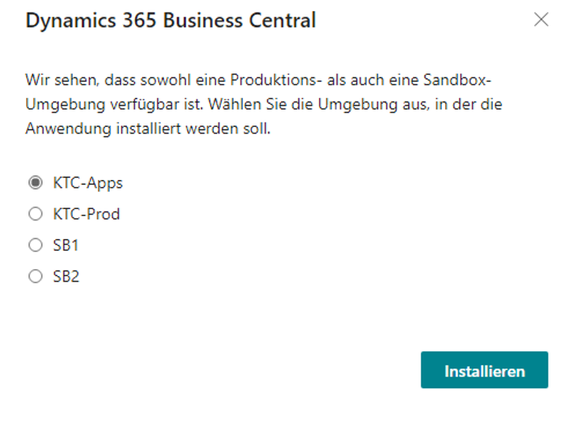 

Fig.12 Dynamics 365 Business Central - Selecting the environment 

By clicking Install, you will be redirected to the extension installation.

### Extension installation

In the extension installation, you can choose from the different languages of the SharePointPlus extension. The supported languages are: English, German, Italian, French, Dutch, Spanish, Polish and Portuguese.
If your BC is set in a language that is not supported by SharePointPlus, the extension will be installed for you in English by default.

 Fig.13 Extension installation: language selection and installation 

Clicking Install will install the app in your environment. The installation of the app may take a few minutes. Once the extension has been successfully installed, you will see a message. Clicking OK will take you back to the start screen.

### Installation progress

To see the successful installation or the installation progress of extensions, enter Extension Management in the search and go to the corresponding menu item.
Via the item Manage you can now get to the view of the installation status.

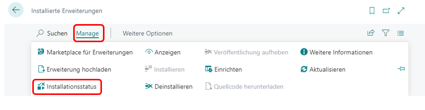 Fig.14 Checking the installation status

An extension is completely installed and ready for use when the status is completed.

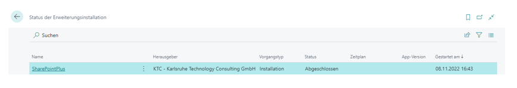 Fig.15 Installation status: completed 

### Accessing the KTC License Management App

If you do not already have the KTC License Management App, it will be installed along with SharePointPlus. This app connects to the license server and lets you retrieve and manage the available licenses.
Important:Please note that SharePointPlus is not operational without the license management. Before the SharePointPlus app can be started, the KTC License Management app must be set up.
Important: To access the KTC License Management app, you need SUPER or SPP LIC LICENCE USER KTC rights.
To open the license management, enter "KTC Liz" in the search and select the KTC License Management app.

 Fig.16 Opening the KTC License Management App

### Initial Setup of the License Management App (New Customers)

To use SharePointPlus as a new customer of our programs, please open KTC License Management first. The program is automatically installed as soon as you have obtained SharePointPlus from the AppSource. To do this, enter License in the search mask and select the KTC License Management administration program.

 Fig.17 Calling the license management 

At the initial call of the KTC License Management App your Tennant ID is not yet set. This will be determined and set automatically in the next step.

 Fig.18 Setting up the KTC License Management Extension 

Start the setup wizard and please enter your company name and email address. All extensions of the KTC will be assigned to this company name and email address.
Warning: You will need this e-mail address to recover the access data. For billing purposes, another e-mail address can be stored later.
Please read the license agreement and confirm that you have read and accepted it.

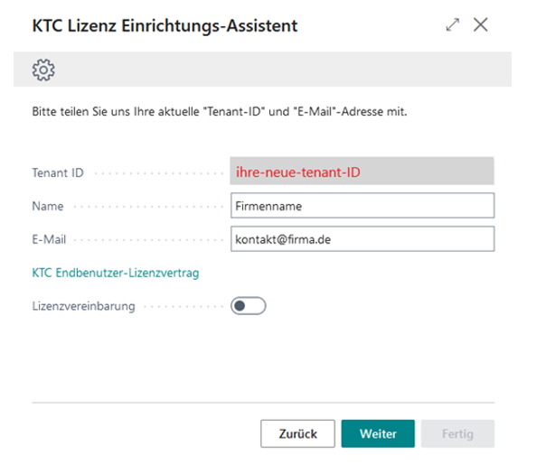

Fig.19 The KTC License Setup Wizard 

Then confirm further. We will now generate a password for you, which you can use to log in to the license management. Please save this password separately. KTC does not save your passwords.
Warning: Please save your login information separately. If you forget or lose your password, a new one will be sent to the email provided. The License Management application does not secure your information.

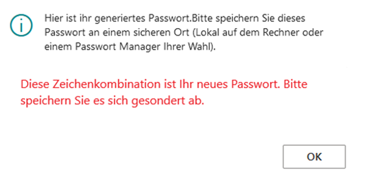

Fig.20 KTC License Management Password (License Key) 

Click OK to save the information. In the next window, click Done to complete the setup. The SharePointPlus extension now automatically appears in the overview of applications licensed via KTC. Note: For security reasons, we do not save your password. Please save your password separately. You will need your password if you want to install the License Manager in additional environments such as sandboxes (e.g. multiple installations in different tennants with the same tennant ID). Forgotten passwords are always replaced by new passwords by the system.

### Initial setup of the License Management App (existing customers)

Since you have already installed a KTC Extension, you are already registered for the KTC License Management App.  Accordingly, you already have an account.
To complete the installation of the SharePointPlus Extension, open the setup wizard of the KTC License Management App (e.g. via Search -> KTC License Management).

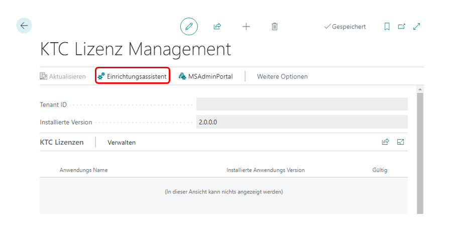
Fig.21 Repeated setup of KTC License Management using the setup wizard 

After opening the setup wizard, please enter your existing credentials to install the new extension on your tenant. Your tenant ID will be automatically filled in for you, so all you need to do is fill in your email and password. If you have forgotten your password, you can request a new one via "Forgot your password?" (cf. Password at KTC License Management App ).

Fig.22 Repeated setup of the KTC License Management App 

After that, please go to Next. The setup of the KTC License Management App is now complete. All valid and available KTC licenses are automatically imported from the KTC license server.
The SharePointPlus App is now installed and appears in your license overview.

### Your Installation progress

To see the installation progress of extensions, type extension management in the search and select the extension to watch. (e.g. SharePointPlus).

 Fig.23 Checking the deployment status 

An extension is fully installed and ready to use when the status is completed.

### Reset password at KTC License Management App

Using the Forgot password? you can have a new password (= license key) generated. A new tab will open where you enter the email address linked to the license and click Submit.

 Fig.24 Reset password (license key) 

A link will be sent to this e-mail address. Click on the link to get the new password. Please save it separately. The old password will lose its validity.

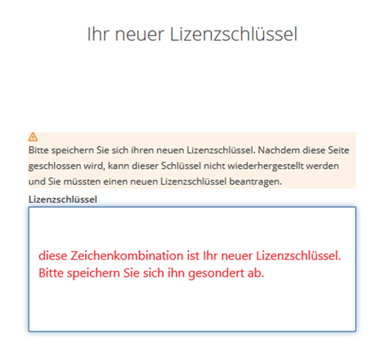

Fig.25 New password (license key) received 

### Update the application

The application is updated via the Microsoft Dynamics 365 Business Central Admin Center. The KTC License Management App additionally shows you if new versions of the KTC extensions are available.

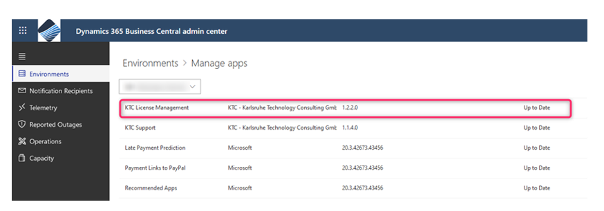 Fig.26 Open the Microsoft Dynamics 365 Business Central Admin Portal 

To open your app overview, go to Environments -> manage apps for a list of installed apps. In this list you will see, among other things, the installed version and the information whether "your" version is also the current one (cf. Fig.23).

 Fig.27 Selection of the environment in the Dynamics 365 Business Central Admin Center 

If necessary, you can update our application to the latest version here. To do this, you must first select the extension that you want to update.
To do this, go to Apps -> Manage Apps -> Update. The KTC License Management and SharePointPlus applications will now be updated to the latest version. Once the update is complete, you can exit the Admin Center and continue working with the applications in your Business Central environment.

### Uninstall the application

In the Business Central activity summary search, type extension and select extension management.
Search for the app you want to delete and go to the administration via the three dots. Select the uninstall menu item.
Alternatively, you can also select the app and select the Uninstall item via the Manage menu item.

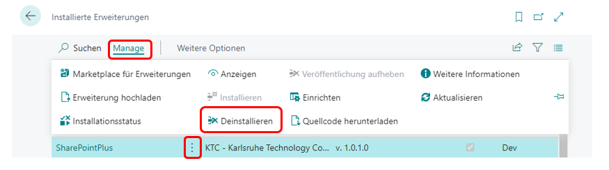 Fig.28 Extension management: Uninstallation 

In the next window you have the choice whether you want to uninstall the application only or whether you want to delete the included data as well. If you only want to uninstall the app, leave the Delete extension data button untouched. If you want to delete all data, click the Delete extension data button.

 Fig.29 Delete extension data 

You can uninstall the app after your selection. Now you have to wait for a few seconds to minutes. The application will be removed from your system and listing. After successful uninstallation you will see a corresponding window.
Hinweis: If KTC License Management is uninstalled, the use of the SharePointPlus extension as well as other of our products is no longer possible.

### User manual - SharePointPlus App

## Licensing

The SharePointPlus App provides various licenses. Licensing is done via the KTC License Management App, which is also installed (cf.reset password at KTC License Management App).
If you download and install the SharePointPlus App from the Marketplace or MS AppSource, you will automatically receive a 30-day trial license.
After the license expires, to continue using SharePointPlus, contact us by email at Anfrage.D365BC-Apps@ktc.de, with information about the number of users you have. The current prices of the SharePointPlus App can be found in the SharePointPlus Flyer.
In order to use the SharePointPlus App, you will need the SPP LIC User KTC.

## Initial setup of the application

Note: To access the SharePointPlus App setup page, you need the SUPER or SPP ADMIN KTC rights. To use the SharePointPlus App, you need either the trial license or a purchased license. The rights you get with the licenses are called SPP LIC User KTC.

## Activate SharePointPlus in the current client

You can activate or deactivate the SharePointPlus App for each client individually. To activate the SharePointPlus App, look for the "SharePointPlus Setup" setup page in the current client.

 Fig.30 Activate and/or configure SharePointPlus 

Please enable SharePoint Plus by activating the switch.

 Fig.31 Activate SharePointPlus in active client 

## Basics

The basic idea of the SharePointPlus app is the automated upload of documents generated in Microsoft Dynamics 365 Business Central. These documents are enriched with the additional information (metadata) specified in Business Central. The following additional information is currently transferred to Microsoft SharePoint.

Fig.32 SharePointPlus in use ](../files/SPPAbb32_DE.png) Fig.32 SharePointPlus in use

Note:

If KTC License Management is uninstalled, the use of the SharePointPlus extension as well as other of our products is no longer possible.

### User manual - SharePointPlus Application

## Licensing - SharePointPlus Application

The SharePointPlus App provides various licenses. Licensing is done via the KTC License Management App, which is also installed (cf.reset password at KTC License Management App).
If you download and install the SharePointPlus App from the Marketplace or MS AppSource, you will automatically receive a 30-day trial license.
After the license expires, to continue using SharePointPlus, contact us by email at Anfrage.D365BC-Apps@ktc.de, with information about the number of users you have. The current prices of the SharePointPlus App can be found in the SharePointPlus Flyer.
In order to use the SharePointPlus App, you will need the SPP LIC User KTC.

## The Initial setup of the application

Important: In order to access the SharePointPlus App setup page, you need the SUPER or SPP ADMIN KTC permissions. To use the SharePointPlus App, you need either the trial license or a purchased license. The permissions you get with the licenses are called SPP LIC User KTC.

## Activate the SharePointPlus App in the current client

You can activate or deactivate the SharePointPlus App for each client individually. To activate the SharePointPlus App, look for the "SharePointPlus Setup" setup page in the current client.

 Fig.30 Activate and/or configure SharePointPlus 

Please enable SharePoint Plus by activating the switch.

 Fig.31 Activate SharePointPlus in active client 

## The Basics

The basic idea of the SharePointPlus App is the automated upload of the documents generated in Microsoft Dynamics 365 Business Central. These documents are enriched with the additional information (metadata) specified in Business Central. The following additional information is currently transferred to Microsoft SharePoint.

Fig.32 SharePointPlus in use ](../files/SPPAbb32_EN.png) Fig.32 SharePointPlus in use 

Note: You need the Microsoft SharePoint licenses in addition to this app. These are not included in this app.

## Configure SharePointPlus

Call up the SharePointPlus Setup page again cf. (Fig. 25: Activate and/or configure SharePointPlus). After this has been activated you will now see the configuration page of the application.
The user who calls the configuration page needs the following permissions:

- SPP Admin KTC - permission set for the administrator.
- SPP LIC User KTC - license permission for SharePointPlus

The configuration page is grouped thematically.

## General information

 

Fig.33 General information - connection to your SharePoint

In the figure you can see a section of the setup page. As soon as you have inserted your information, it will be stored in the system.
Now click on Create Access Token. This will generate an Access Token that will allow you to access Microsoft SharePoint.
Note: In Microsoft SharePoint you need appropriate rights to the libraries, lists and documents.

## Setting up the dimensions and format rules

In the following dimension screen, you can set two dimension codes that will be used to sort your files. Dimensions also allow you to have the system generate reports on the linked content. Select here from your previously entered list. Missing dimensions and their codes must be defined via the dimension management before they can be used by SharePointPlus.

Fig.34 Assignment of the dimensions to be passed to SharePoint 

Here it should be mentioned that SharePointPlus works with four central dimensions: DIM1 and DIM2, which you can specify here, and the document ID (doc.id), which make the files distinguishable from each other.
DIM1 and DIM2 can be freely selected from all dimensions stored in Business Central.

Doc.ref is a dimension defined by Business Central. You do not need to consider it when setting up SharePointPlus.

The fourth dimension is ref.ID, which is the identification of the reference between documents. What distinguishes the ref.ID from the others is the fact that, unlike the first three, the ref.ID is not assigned globally.

The global metadata is given and evaluated by the system, and therefore can only perform global evaluations. The ref.ID, on the other hand, works at the row level, which allows for more accurate statistics.

Another dimension is the doc.id. This is always the series of numbers that distinguishes one document from the others. You do not need to define it further.

Occasionally you will also see the DocType dimension. This is created automatically and indicates the document type. In this way, orders can be distinguished from sales in the evaluation.

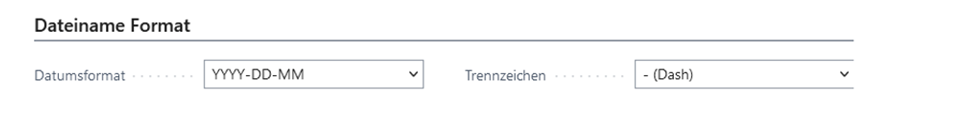 Fig.35 Defining the file format for the SharePoint document 

Next, you define the standardized format that SharePointPlus should work with. First you define your desired date format, then the separator you want to use to separate the partial information from each other. For example, a file name can take the following form:
Beispiel: YYY-DD-MM - (dash) → 2022-21-10 - UserManual.pdf

### Set up available pages and lists

This is where you set up pages and lists to be managed using SharePointPlus.

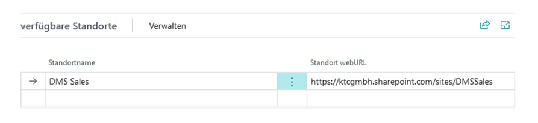 Fig.36 : Connect to available SharePoint libraries 

Note: Please note that you must first activate SharePointPlus, complete your information and create an access authorization in order to be able to edit the following items. Without a valid access authorization, the options shown below will only be partially displayed or not displayed at all, which means that SharePointPlus cannot be configured appropriately and thus can only be used to a limited extent.
First select the page here that you want to have managed. The URL will be added automatically by the system, as it should already be stored in the corresponding file.
This setting is urgent, otherwise you will not be able to access the functions of SharePointPlus on these pages. The pages that you can access with SharePointPlus are predefined by Business Central. You cannot add or remove anything here. If you do not want to use certain pages, do not select them here.
The list order is where you configure the systems you want your tables and pages to be added to. You cannot upload your documents directly to the previously selected site; they must first be added to lists, which you can then manage with SharePointPlus. These lists are provided with table number, name and linked document type.

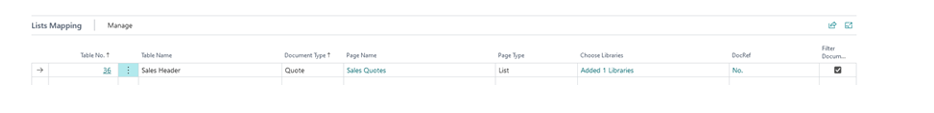 Fig.37 : Page-related definition of the SharePoint lists to be displayed 

Please note that Document Type here refers to the content of the document, not the file type. Also, you can only add pages, lists and libraries already set up in SharePoint here.
A completely missing option must be set up through SharePoint itself before SharePointPlus can access it.
You must assign at least one library to the selected tables to be used for management.
Specify a source and upload folder here. These help to structure and sort the documents. If you want to see these folders also in the SharePointPlus interface, click Show folders here.

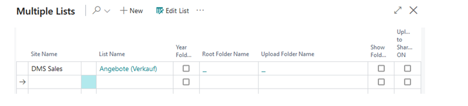 Fig.38 : Add lists to the selected SharePoint library 

With a click on Upload to SharePoint AN the documents entered here will be integrated directly into your SharePoint environment.

Note: Please note that only one list can be marked with an automatic upload at a time. If you select one list here, the function will be disabled automatically for all others.

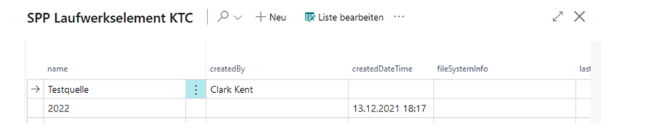 Fig.39 : Set source folder per list 

Select here one of the stored source folders, if they should be stored in the SharePointPlus interface. If you do not select anything here, only the list title and the files it contains will be displayed in SharePointPlus. Once you have set up the correct source folder, confirm your selection with OK to return to the setup.

## Set filters

In the library selection you can assign filters to the contained lists via the three points -> Filter Mapping to the list contents.

 Fig.40 : Selection of SharePoint lists 

Select a Business Central field and a SharePoint column in the overview for this purpose. The columns available for selection depend on the selected field. You can freely select the field from Business Central. You can set a filter for each list.
The configuration of the filters is completely optional. If you do not set anything here, the SharePointPlus interface will always show you the entire list content.
Click the arrow in the upper left corner or press Esc to return to the library selection.
Press OK to save the settings for the current list.

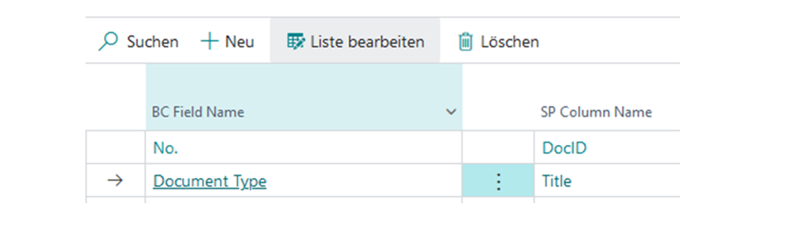 Fig.41 : Assigning the metadata

 Fig.42 : Adding the libraries 

Use current year creates a new folder - for sorting your documents. In this folder the documents are sorted into the correct year folder by the format given in 5.2.2. This way you can have files from different years managed without any problems.
If you do not want the year folder to be displayed in your SharePointPlus environment, uncheck Show folder year here. If this function is deactivated, you will only see the libraries and the files they contain in the SharePointPlus interface. If you want to display the documents sorted by the dates, activate the check mark here.
In this overview, you can check and uncheck all the hooks as you like. They only affect the behavior of SharePointPlus with respect to the specific list. They do not change among themselves.
Via DocRef you can define metadata that is only used for the documents contained in the list. Again, select from the predefined list. If you are missing dimensions, you can add them via the dimension management in Business Central. With the next update, the information will be created in the SharePointPlus setup.
If you have specified a DocRef, you can use a check mark in Filter Document to ensure that this list is only displayed in filtered form in SharePointPlus. If you do not check this box, all documents in the list will be displayed in the SharePointPlus interface. Please note that you cannot have the list filtered if you have not defined a DocRef. This setting only affects the behavior of this one list. You can also define a filter in the library selection and then decide here to display the list unfiltered.
All other fields are created automatically by SharePointPlus, provided that the necessary information has been stored in the selection options.

## Activate access and export

To use SharePointPlus you need permissions that go beyond the roles and rights of Business Central.

 Fig.43 : Access permissions (Access token) 

Create Access Credential creates a one-time Access Token that you can use to connect SharePointPlus to SharePoint and Business Central and share the programs. Such tokens are inherently valid only for a specific, short period of time. Therefore, if necessary, you can extend the lifetime of the credential with Update Access Credential.
This function allows you to save the settings you have made in a file in order to share them. This makes sense if all your employees should work with the same settings in the same license and the same application structure. This way you can avoid incorrect or missing sorting due to irregular settings of individual users.
The export saves the information in a file for download as well as for sharing, the import offers the possibility to include an already existing settings file into the SharePointPlus setup to copy settings from another version.

 Fig.44 : Save and load configurations 

## SharePointPlus in Business Central

Via Sales -> Sales offers in Business Central you get to an overview of all your current sales offers. With SharePointPlus you can access the related documents directly in this overview.

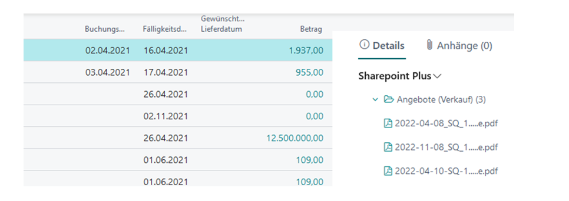 Fig.45 : SharePointPlus in the list view of sales offers 
Important: Bitte beachten Sie, dass Sie den Infoboxbereich hierfür erweitern müssen. Die SharePointPlus-Oberfläche wird nur innerhalb des Infoboxbereiches angezeigt.
Die Dateien, die mit dem ausgewählten Kunden verknüpft sind, werden hier seitlich angezeigt. Die Dateien werden nach Ihren in der Installation definierten Einstellungen sortiert. So haben Sie alles auf einen Blick.
Please note that you need to expand the infobox area for this. The SharePointPlus interface is displayed only inside the infobox area.
The files associated with the selected customer are displayed here on the side. The files are sorted according to your settings defined in the installation. So you have everything at a glance.

## The filter function

In the upper left corner of the SharePointPlus interface, you will find a small funnel icon if you had filters set up for the retrieved lists when you set up SharePointPlus. This icon is for your information only. If it is not displayed, no filter was set up for the list.
The filter function is automatically applied in the background if you have set up a filter and activated the function. You do not need to select anything else in SharePointPlus.
The filters set up match the field name in Business Central with the column names in SharePoint.

## The SharePointPlus menu

You can expand or collapse certain lists and folders here according to your needs, so that you can navigate the documents as easily as possible. Clicking on SharePoint Plus opens a drop-down menu that allows you to perform various actions in SharePointPlus.

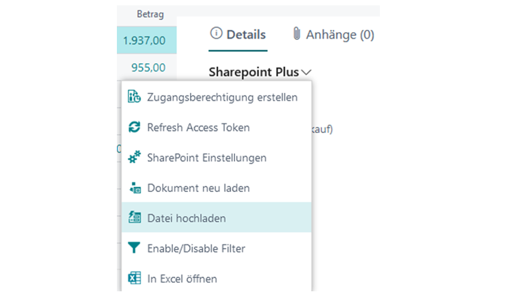 Fig.46 : The SharePointPlus Menu 

With Create access authorization you can, as in the setup of the application, create a new access for the current user and update it if necessary. This may require the user to log in again.
Using SharePoint Settings, you can access the setup page from 5.2 to make short-term changes to the settings. For example, you can add more libraries to your lists here, as well as adjust minor display settings.
Reload document refreshes the SharePointPlus view. This can be useful if you have made changes in the settings.
Upload file allows you to add more files to the view. It may take some time for the document to be processed and stored correctly by SharePointPlus. This is not a cause for concern.
Open in Excel downloads a file of the document to your PC, which you can use to open the overview in Excel. This file is automatically a read-only copy; however, in the Excel interface you can enable editing.
Here you will now also find the new Upload to SharePoint function. When you press this button, the respective documents (i.e. either all or only the filtered ones) are uploaded to SharePoint at the same time. So you don't have to link them there manually, but you can do several actions in one step.
If you have filters set up but you don't want to use them now, you can disable them via Turn Filters On/Off. The lists will still be filtered in the background, but all files in the list will be displayed for you.
Documents managed with SharePointPlus can of course also be uploaded to SharePoint in the usual way and retrieved there. SharePointPlus only takes care of the sorting and direct linking of your SharePoint documents in your listing.
With Print in the task list above your view you can print or send the selected table somewhere. Furthermore, you can filter your selection here so that for example only the sales quotations are printed.

 Fig.47 : Upload document to SharePoint by selection in print dialog. 
