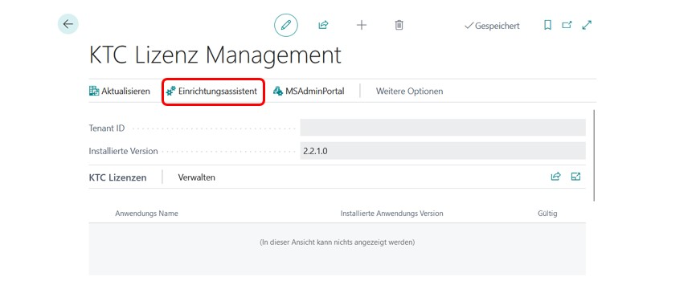

# Vendor Rating | Lieferantenbewertung MS Business Central App V1.1

## Inhaltsverzeichnis

1. [Installation und Lizenzmanagement](#installation-und-lizenzmanagement)
2. [Installation](#installation)
3. [Berechtigungen für die Installation einer Erweiterung](#berechtigungen-für-die-installation-einer-erweiterung)
4. [Installation über Marketplace](#installation-über-marketplace)
5. [Installation aus der AppSource](#installation-aus-der-appsource)
6. [Fortschritt der Installation](#fortschritt-der-installation)
7. [Aufrufen der KTC Lizenz Management App](#aufrufen-der-ktc-lizenzmanagement-app)
8. [Ersteinrichtung der Lizenzmanagement-App (Bestandskunden))](#ersteinrichtung-der-lizenzmanagement-app-bestandskunden)
9. [Passwort der KTC Lizenzmanagement App zurücksetzen)](#passwort-der-ktc-lizenzmanagement-app-zurücksetzen)
10. [Verwaltung von KTC-Lizenzen](#verwaltung-von-ktc-lizenzen)
11. [Aktualisieren der Anwendung](#aktualisieren-der-anwendung)
12. [Deinstallieren Sie die Anwendung](#deinstallieren-sie-die-anwendung)
13. [Vendor Rating Applikation](#vendor-rating-applikation)
14. [Anwendungsbereich](#anwendungsbereich)
15. [Lizensierung](#lizensierung)
16. [Ersteinrichtung der Anwendung](#ersteinrichtung-der-anwendung)
17. [Aktivieren von SharePointPlus im aktuellen Mandanten](#aktivieren-von-sharepointplus-im-aktuellen-mandanten)
18. [Konfiguration](#konfiguration)
19. [Benutzer-Szenario](#benutzer-szenario)
20. [Neues Feld "Score" des Lieferanten und Score der Bestellung](#neues-feld-score-des-lieferanten-und-score-der-bestellung)
21. [Bewertung der Bestellung von einem Lieferanten](#bewertung-der-bestellung-durch-den-lieferanten)
22. [Berechtigungen](#berechtigungen)
23. [Benutzerbezogene Lizenzierung](#benutzerbezogene-lizenzierung)
24. [Changelog](#changelog)
25. [Roadmap](#roadmap)
26. [Verfügbarkeit](#verfügbarkeit)

## Installation und Lizenzmanagement

### Installation

Bitte beachten Sie, dass Vendor Rating erst ab Version 19.0 verfügbar ist. Das bedeutet, dass Ihre Umgebung mindestens auf die Version 19.0 aktualisiert sein muss, damit Vendor Rating an Ihrem Standort funktioniert.  

### Berechtigungen für die Installation einer Erweiterung

Ihr Unternehmensadministrator muss Ihnen die folgenden Berechtigungen in Business Central erteilen, um eine KTC-Erweiterung in Ihrer Umgebung zu installieren: D365 EXTENSION MGT oder EXT MGT. - ADMIN.

 Abb.1 MS D365 BC - Berechtigungen

### Installation über Marketplace

Die KTC Vendor Rating App kann direkt in Business Central über den Marketplace für Erweiterungen installiert werden.
Geben Sie dazu im Suchfeld Marketplace ein und wählen Sie den Marketplace für Erweiterungen aus.

 Abb.2 Microsoft Marketplace für Erweiterungen (AppSource)

 Geben Sie im Suchfeld des Marketplace Vendor Rating oder KTC Vendor Rating ein und wählen Sie die unten abgebildete App aus.  

  Abb.3 Marketplace Verkäufer Bewertung

 Mit einem Klick auf Free "trial" gelangen Sie in die Installation der Erweiterung.

### Installation aus der AppSource

Sie können die App auch direkt aus der Microsoft AppSource installieren. Melden Sie sich dazu in der MS AppSource an und suchen Sie nach der Erweiterung Vendor Rating.

 Abb.4 ContractPlus direkt in MS AppSource, Aufruf über Browser

In dieser Übersicht können Sie die Anwendung durch Anklicken des Buttons "Free trial" zu Ihrer Business Central Umgebung hinzufügen.
Nach einem Klick auf die Schaltfläche "Free trail" werden Sie zu Ihrem Dynamics 365 Business Central weitergeleitet. Es erscheint ein Fenster, in dem Sie auswählen können, in welcher Umgebung Sie die Erweiterung installieren möchten.

 Abb.5 Dynamics 365 Business Central - Umgebungsauswahl

Wenn Sie auf "Installieren" klicken, werden Sie zur Installation der Erweiterung weitergeleitet (4.1.4). Installation der Erweiterung
Die Erweiterung Vendor Rating kann nur mit Hilfe einer Lizenz genutzt werden. Zu diesem Zweck wird bei der Installation der Erweiterung automatisch die KTC License Management App heruntergeladen. Mit dieser App werden alle Lizenzen für KTC-Anwendungen verwaltet (4.4 Starten der KTC-Lizenzmanagement-App).
Bei der Installation der Erweiterung können Sie zwischen den verschiedenen Sprachen der Vendor Rating Extension wählen. Die unterstützten Sprachen sind: Englisch, Deutsch, Italienisch, Französisch, Niederländisch, Spanisch, Polnisch und Portugiesisch.
Wenn Ihr BC auf eine Sprache eingestellt ist, die von Vendor Rating nicht unterstützt wird, wird die Erweiterung automatisch auf Englisch installiert.

 Abb.6 Installation der Erweiterung: Sprachauswahl und Installation

Wenn Sie auf Installieren klicken, wird die Anwendung in Ihrer Umgebung installiert. Die Installation der App kann ein paar Minuten dauern. Sobald die Erweiterung erfolgreich installiert ist, erhalten Sie eine Meldung. Mit OK werden Sie zum Startbildschirm zurückgeleitet.

### Fortschritt der Installation

Um die erfolgreiche Installation bzw. den Installationsfortschritt von Erweiterungen zu sehen, geben Sie in der Suche Erweiterungsverwaltung ein und gehen Sie auf den entsprechenden Menüpunkt.
Über den Punkt Verwalten gelangen Sie nun zur Ansicht des Installationsstatus.

 Abb.7 Installationsstatus prüfen

Eine Erweiterung ist vollständig installiert und einsatzbereit, wenn der Status "completed" anzeigt.

 Abb.8 Installation prüfen abgeschlossen

### Aufrufen der KTC Lizenzmanagement-App

Sobald Sie eine App über den Marketplace oder MS App Source installieren, müssen Sie die KTC License Management App einrichten, um die entsprechende App nutzen zu können.
Wenn Sie die KTC License Management App noch nicht haben, wird sie zusammen mit ContractPlus installiert. Diese App stellt eine Verbindung zum Lizenzserver her und ermöglicht es Ihnen, die verfügbaren Lizenzen abzurufen und zu verwalten.
Wichtig: Bitte beachten Sie, dass das Vendor Rating ohne die Lizenzmanagement-App nicht funktionsfähig ist. Bevor die App "Vendor Rating" gestartet werden kann, muss die App "KTC License Management" eingerichtet werden.
Wichtig: Um auf die KTC Lizenzmanagement-App zugreifen zu können, müssen Sie die Rechte SUPER oder LIC LICENCE USER KTC besitzen. Um das Lizenzmanagement zu öffnen, geben Sie in der Suche "KTC Liz" ein und wählen Sie die KTC Lizenzmanagement App aus.

 Abb.9 Aufruf der KTC Lizenzmanagement App

### Erstmalige Einrichtung der Lizenzmanagement-App (Neukunde)

Um ContractPlus als Neukunde unserer Programme zu nutzen, öffnen Sie bitte zunächst das KTC Lizenzmanagement. Das Programm wird automatisch installiert, sobald Sie ContractPlus über die AppSource bezogen haben. Geben Sie dazu in der Suchmaske Lizenz ein und wählen Sie das Verwaltungsprogramm KTC Lizenzmanagement aus.

 Abb.10 Aufruf des Lizenzmanagements

Beim ersten Start der KTC Lizenzmanagement App ist Ihre Mieter-ID noch nicht gesetzt. Diese wird im nächsten Schritt automatisch ermittelt und eingestellt.

 Abb.11 Einrichten der KTC Lizenzmanagement Erweiterung

Starten Sie den Einrichtungsassistenten und geben Sie bitte Ihren Firmennamen und Ihre E-Mail-Adresse ein. Alle Erweiterungen des KTC werden diesem Firmennamen und dieser E-Mail-Adresse zugewiesen.
Achtung! Sie benötigen diese E-Mail-Adresse, um die Zugangsdaten wiederherzustellen. Für Abrechnungszwecke kann später eine andere E-Mail-Adresse hinterlegt werden.
Bitte lesen Sie die Lizenzvereinbarung und bestätigen Sie, dass Sie diese gelesen haben und akzeptieren.

 Abb.12 Der KTC Lizenzeinrichtungsassistent

Bestätigen Sie anschließend Ihre Eingabe mit Weiter. Das KTC generiert nun automatisch ein Passwort für Sie, mit dem Sie sich in der Lizenzverwaltung anmelden können.

 Abb.13 KTC Lizenzmanagement Passwort (Lizenzschlüssel)

Klicken Sie auf OK, um die Informationen zu speichern. Klicken Sie im nächsten Fenster auf Fertig, um die Einrichtung abzuschließen. Die ContractPlus-Erweiterung wird nun automatisch in der Übersicht der über KTC lizenzierten Anwendungen angezeigt.
Hinweis: Aus Sicherheitsgründen speichern wir Ihr Passwort nicht. Bitte speichern Sie Ihr Passwort separat. Sie benötigen Ihr Passwort, wenn Sie den Lizenzmanager in weiteren Umgebungen wie z.B. Sandboxen installieren wollen (z.B. mehrere Installationen in verschiedenen Tenants mit der gleichen Tenant-ID). Vergessene Passwörter werden vom System immer durch neue Passwörter ersetzt.

### Ersteinrichtung der Lizenzmanagement-App (Bestandskunden)

Da Sie eine KTC Erweiterung installiert haben und bereits für die KTC Lizenzmanagement App registriert sind.  Sie haben bereits Zugriff auf die App.
Um die Installation der ContractPlus Extension abzuschließen, öffnen Sie den Einrichtungsassistenten der KTC Lizenzmanagement App ( z.B. über die Suche KTC Lizenzmanagement).

 Abb.14 Einrichten der KTC Lizenzmanagement Erweiterung

Nachdem Sie den Einrichtungsassistenten geöffnet haben, geben Sie bitte Ihre bestehenden Anmeldedaten ein, damit Sie die neue Erweiterung auf Ihrem Mandanten installieren können. Ihre Mieter-ID wird automatisch für Sie ausgefüllt, so dass Sie nur noch Ihre E-Mail und Ihr Passwort eingeben müssen. Sollten Sie Ihr Passwort vergessen haben, können Sie über "Passwort vergessen?" ein neues anfordern (vgl. Passwort der KTC License Management App ).

 Abb.15 Mehrmaliges Einrichten der KTC Lizenzmanagement App

Bitte gehen Sie anschließend auf "Weiter". Die Einrichtung der KTC Lizenzmanagement App ist nun abgeschlossen. Alle gültigen KTC Lizenzen werden automatisch vom KTC Lizenzserver importiert.
Die ContractPlus App ist nun installiert und wird in Ihrer Lizenzübersicht angezeigt.

 Abb.16 Lizenzübersicht

Die Einrichtung der KTC Lizenzmanagement App ist nun abgeschlossen. Sie können nun die ContractPlus App nutzen.

### Passwort der KTC Lizenzmanagement App zurücksetzen

Benutzen Sie den Button Passwort vergessen, um ein neues Passwort (=Lizenzschlüssel) zu generieren. Es öffnet sich eine neue Registerkarte, in der Sie die mit der Lizenz verknüpfte E-Mail-Adresse eingeben und auf Senden klicken müssen.

 Abb.17 Passwort zurücksetzen (Lizenzschlüssel)

Ein Link wird an diese E-Mail gesendet. Klicken Sie auf den Link, um das neue Passwort zu erhalten. Bitte speichern Sie dieses separat. Das alte Passwort verliert hiermit seine Gültigkeit.

 Abb.18 neues Passwort erhalten (Lizenzschlüssel)

### Verwaltung von KTC-Lizenzen

Wenn Sie den Status Ihrer Lizenzen überprüfen möchten, öffnen Sie die KTC Lizenzmanagement App und wählen Sie die Anwendung aus, die Sie überprüfen möchten (1) und klicken Sie auf Aktualisieren (2).
In der Übersicht können Sie sehen, ob die Lizenz gültig ist, wenn Sie detaillierte Informationen benötigen, finden Sie weitere Informationen unter Verwalten.

 Abb.19 Manuelle Kontrolle der installierten Lizenzen

Wenn Sie die App nicht mehr verwenden möchten, können Sie die installierten Apps in der Erweiterungsverwaltung markieren und deinstallieren.

### Aktualisieren der Anwendung

Die Aktualisierung der Anwendung erfolgt über das Microsoft Dynamics 365 Business Central Admin Center. Die KTC Lizenzmanagement App zeigt Ihnen zusätzlich an, ob neue Versionen der KTC Erweiterungen verfügbar sind.

 Abb.20 Öffnen des Microsoft Dynamics 365 Business Central Admin Portals

Um Ihre App-Übersicht zu öffnen, gehen Sie über Environments manage apps zu einer Liste der installierten Apps. In dieser Liste sehen Sie u.a. die installierte Version und die Information, ob "Ihre" Version auch die aktuelle ist (siehe Abbildung 20).

 Abb.21 Umgebung auswählen im Dynamics 365 Business Central Admin Center

Falls erforderlich, können Sie hier unsere Anwendung auf die neueste Version aktualisieren. Dazu müssen Sie zunächst die Erweiterung auswählen, die Sie aktualisieren möchten.
Gehen Sie dazu auf Apps Verwalten Apps aktualisieren. Die Anwendungen KTC Lizenzmanagement und ContractPlus werden nun auf die neueste Version aktualisiert. Sobald die Aktualisierung abgeschlossen ist, können Sie das Admin Center verlassen und die Arbeit mit den Anwendungen in Ihrer Business Central-Umgebung fortsetzen.

### Deinstallieren Sie die Anwendung

Geben Sie in der Business Central Aktivitätsübersicht "Erweiterung" ein und wählen Sie Erweiterungsverwaltung.

 Abb.22 Aufrufen der Erweiterungsverwaltung

Markieren Sie die App KTC License Management und wählen Sie Verwalten -> Deinstallieren. Alternativ können Sie auch auf das Ja klicken, das in der Erweiterungsübersicht vor der Anwendung KTC Lizenzmanagement erscheint. Wählen Sie im nächsten Fenster aus, ob Sie auch die in der Erweiterung angelegten Daten löschen möchten und bestätigen Sie die Installation mit einem Klick auf Deinstallieren. Die Anwendung wird nun von Ihrem System entfernt; alle Daten dieser Anwendung werden gelöscht.
Hinweis: Wenn KTC License Management deinstalliert wird, ist es nicht mehr möglich, die Erweiterung Vendor Rating und eines unserer anderen Produkte zu verwenden.

## Vendor Rating Applikation

 Abb.23 Logo der Vendor Rating App

### Anwendungsbereich

Vendor Rating ist eine einfache und einheitliche Verkäufer-Bewertungs-App für Microsoft Dynamics 365 Business Central. Dabei wurde auf eine einfache und selbsterklärende Umsetzung geachtet.
Bewerten Sie Ihre Lieferanten einheitlich und ordnen Sie präzise zwischen 0 Sternen und 5 Sternen.
Darüber hinaus können Sie beliebige Kategorien anlegen, die Sie individuell gewichten können und aus denen die Bewertung der Bestellung errechnet wird.
Aus den Einzelbewertungen wird dann die Gesamtbewertung des Lieferanten errechnet. Die folgenden Berechnungsmethoden werden unterstützt:

- Durchschnitt : aus allen bewerteten Bestellungen. (Wikipedia | Gewichteter Durchschnitt, 2021)
- Lineare Gewichtung nach der Anzahl der Bewertungen (die jüngste Bestellung wird stärker gewichtet als die älteste).

Hierdurch wird es möglich, einheitlich und zentral Einkaufsvorgaben zu machen bzw. bei schlechten Lieferanten nicht mehr einzukaufen. Die Bewertung wird direkt beim Lieferanten gespeichert und steht für allgemeine Auswertungen zur Verfügung. Bestellungen, die nicht bewertet werden, gehen nicht in die Bewertung ein. Einfach und intuitiv.
Verschaffen Sie sich einen Überblick über die Leistung Ihrer Lieferanten direkt aus Microsoft Dynamics 365 Business Central und sortieren Sie Ihre Lieferanten nach deren Bewertung.
Alles nach dem bewährten 0- bis 5-Sterne-System.

## Eine Lösung der KTC - Kompetent, ehrlich und zuverlässig - The Vendor Rating App.:

## Lizensierung

Die Vendor Rating App stellt verschiedene Lizenzen zur Verfügung. Die Lizenzierung erfolgt über die KTC License Management App (siehe 4.2).
Wenn Sie die Vendor Rating App aus dem Marketplace oder MS AppSource herunterladen und installieren, erhalten Sie automatisch eine 30-tägige Testlizenz.
Wenn Sie Vendor Rating nach Ablauf der Lizenz weiter nutzen möchten, wenden Sie sich bitte per E-Mail an Anfrage.D365BC-Apps@ktc.de und teilen Sie uns die Anzahl der Nutzer mit. Die aktuellen Preise für die Vendor Rating App finden Sie im SharePointPlus-Flyer.
Sie benötigen den VRA LIC User KTC, um die Vendor Rating App nutzen zu können.

### Ersteinrichtung der Anwendung

Wichtig:
Um auf die Einrichtungsseite der Vendor Rating App zugreifen zu können, benötigen Sie SUPER oder VRA ADMIN KTC Rechte. Um die SharePointPlus-App zu nutzen, benötigen Sie entweder die Testlizenz oder eine gekaufte Lizenz. Die Rechte, die Sie mit den Lizenzen erhalten, heißen VRA LIC User KTC.

### Aktivieren von SharePointPlus im aktuellen Mandanten

Sie können die Vendor Rating App für jeden Mandanten einzeln aktivieren oder deaktivieren. Um die Vendor Rating App zu aktivieren, suchen Sie im aktuellen Mandanten die Einrichtungsseite "Configuration: Vendor Rating" im aktuellen Mandanten nach der Einrichtungsseite.

 Abb.24 Vendor Rating aktivieren und/oder konfigurieren

Bitte aktivieren Sie SharePoint Plus durch Betätigen des Schalters.  

 Abb.25 Vendor Rating App Konfigurationsseite

### Konfiguration

Öffnen Sie die Seite: Konfiguration Anbieterbewertung und der Assistent wird Sie durch den Prozess führen.

 Abb.26 Anbieterbewertung aktivieren

1.Wählen Sie Ihre Bewertungsmethode

- Durchschnitt - alle bewerteten Aufträge gehen mit der gleichen Gewichtung in die Ergebnisberechnung ein
- Linear (Anzahl) - die Gewichtung der Bewehrung nimmt linear über die Anzahl ab.

2.Abkürzung der Bewertungskategorie
3.Bewertungskategorie (Name)
4.Gewichtung der Kategorie
Die Gewichtung muss zwischen 1 und 99 liegen.

Eine Gewichtung von 0 ist nicht zulässig und führt zu einer Fehlermeldung.

## Benutzer-Szenario

### Neues Feld "Score" des Lieferanten und Score der Bestellung

Hinzufügen neuer Felder in der Listenansicht der Lieferantenseite.

 Abb.27 Listenansicht der Lieferantenseite

Hinzufügen neuer Felder in der Ansicht der Anbieterseite

 Abb.28 Ansicht der Lieferantenseite

Hinzufügen neuer Felder in der Ansicht der Bestellliste

 Abb.29 Ansicht der Bestellliste

### Bewertung der Bestellung durch den Lieferanten

1. Eine Bestellung kann direkt bewertet werden. (1)

2. Oder der Gesamtwert wird über die gewichteten Einzelbewertungen der Kategorien berechnet. (2)

 Abb.30 Bewerten Sie die Bestellung

In diesem Beispiel werden 5, 3 und 4 Punkte vergeben und der Gesamtscore wird über die Kategorien und die definierte Gewichtung auf der Einrichtungsseite berechnet.

 Abb.31 Bewertung über Kategorien bei der Bestellung

Mit einer Gewichtung von
 Abb.32 Setup-Seite - Gewichtung

Daraus resultiert die folgende Formel:
 Abb.33 Berechnung des gewichteten Durchschnitts

### Berechtigungen

Für die App "Vendor Rating" sind keine Berechtigungssätze installiert.

The Vendor Rating App has no permission sets installed.

### Benutzerbezogene Lizenzierung

Die Lizenzierung ist benutzerbezogen. Es werden alle Systembenutzer der Umgebung gezählt.

- Testzeitraum: 1-monatiger kostenloser Testzeitraum
- Kurzjahr: monatlich im Voraus bis zum Ende des Kalenderjahres (31.12. des laufenden Jahres)
- Kalenderjahr: Jährlich im Voraus

### Changelog

- Hinzufügen von Kategorien und deren individuelle Gewichtung
- Bewertung nach Kategorien oder Gesamtbewertung
- Fehlerbehebung

#### Vendor Rating App Version 1.1

• Hinzufügen von Kategorien und deren individuelle Gewichtung
• Bewertung nach Kategorien oder Gesamtbewertung
• Fehlerbehebung

#### Vendor Rating App Version 1.0

- Erste Erstellung der App
- Bestellungen können zwischen 0 und 5 Sternen bewertet werden
- Verschiedene Bewertungsmethoden (Durchschnitt und linear nach Anzahl).
- Erweitern der Detailansicht des Lieferanten um die Bewertung
- Hinzufügen des Feldes Lieferantenbewertung in der Listenansicht der Lieferanten
- Archivierung von Bestellungen inklusive der Bewertung

### Roadmap

Wir lassen uns von den Ideen unserer Kunden leiten - Bitte teilen Sie uns Ihre Wünsche mit.

- Hinzufügen von Berechtigungssets
- Hinzufügen weiterer Sprachen (Italienisch, Kroatisch, Serbisch, Polnisch, Russisch, Französisch, Spanisch)

## Verfügbarkeit

### Unterstützte Editionen

Die App unterstützt die Essentials und Premium Editionen von Microsoft Dynamics 365 Business Central.

### Unterstützte Länder

Diese App unterstützt die folgenden Länder: Deutschland, Österreich, Schweiz, Vereinigtes Königreich und die USA.

### Unterstützte Sprachen

Diese App ist in Englisch (Vereinigte Staaten) und Deutsch (Deutschland) verfügbar.

### Support

Wir bieten kostenpflichtigen Support und Schulungen in Englisch und Deutsch an.
Bitte kontaktieren Sie uns per E-Mail: D365BC.VRA@ktc.de

### Wie Sie die App kaufen können

Besuchen Sie unsere Website unter: <https://ktc.de/bc/app/vra/>
Hier finden Sie die aktuellen Preise und weitere Informationen.
Oder kontaktieren Sie uns per E-Mail: D365BC.VRA@ktc.de
