# Vendor Rating | Lieferantenbewertung MS Business Central App V1.1

## 	Installation and license management
### Installation 
Please note that Vendor Rating is only available from version 19.0. This means that your environment must be updated to at least version 19.0 for Vendor Rating to be operational at your site.  

### Permissions to install an extension
Your company administrator must grant you the following permissions in Business Central to install a KTC extension in your environment: D365 EXTENSION MGT or EXT MGT. - ADMIN. 

 Fig.1 MS D365 BC – Permissions

### Installation via  Marketplace

The KTC Vendor Rating App can be installed directly in Business Central via the Marketplace for Extensions.
Enter Marketplace in the search box and select the Marketplace for extensions.

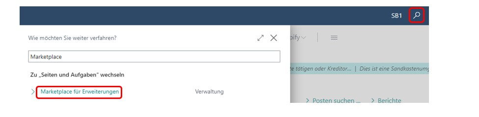 Fig.2 Microsoft Marketplace for Extensions (AppSource)

 In the Marketplace search box, enter Vendor Rating or KTC Vendor Rating and select the app shown below.  

 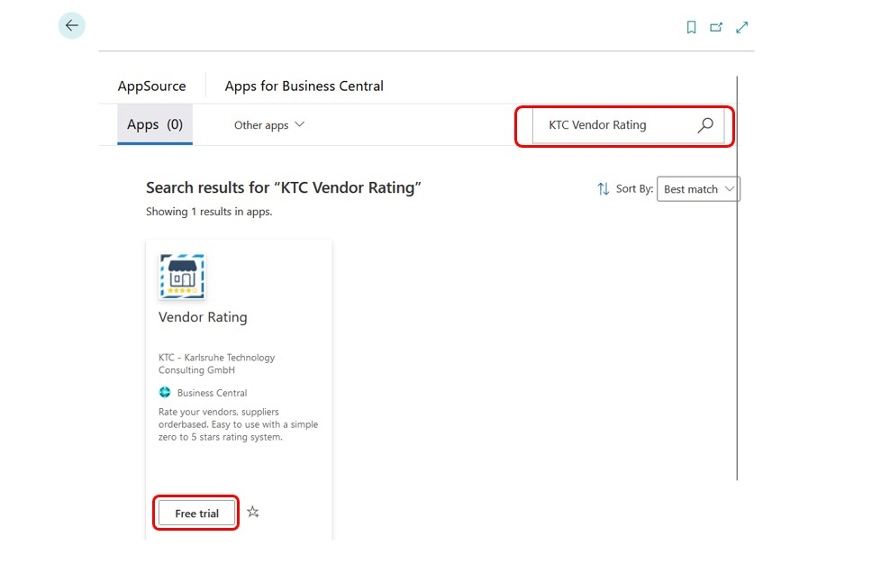 Fig.3 Marketplace Vendor Rating

 With a click on Free “trial” you get into the extension installation.

 ### Installation from the AppSource

You can also install the app directly from the Microsoft AppSource. To do this, log in to the MS App Source and search for the Vendor Rating extension. 

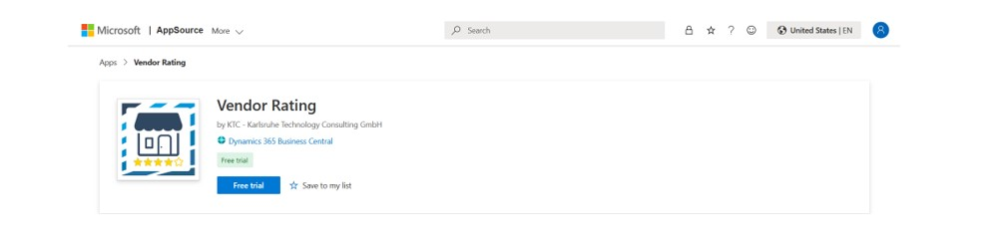 Fig.4 ContractPlus directly in MS AppSource, call via browser

You can add the application to your Business Central environment in this overview by clicking the "Free trial" button. 
After clicking the Free trail button, you will be redirected to your Dynamics 365 Business Central. A window will appear where you can choose on which environment you want to install the extension. 

 Fig.5 Dynamics 365 Business Central – Environment selection

By clicking “Install” you will be redirected to the extension installation (4.1.4). Extension installation
The Vendor Rating extension can only be used with the help of a license. For this purpose, the KTC License Management App is automatically downloaded when you install the extension. This app is used to manage all licenses for KTC applications (4.4 Starting the KTC License Management App).
In the extension installation, you can select from the different languages of the Vendor Rating extension. The supported languages are: English, German, Italian, French, Dutch, Spanish, Polish and Portuguese. 
If your BC is set in a language that is not supported by Vendor Rating, the extension will automatically be installed in English .

 Fig.6 Extension installation: language selection and installation

Clicking Install will install the app in your environment. The installation of the app may take a few minutes. Once the extension is successfully installed, you will see a message. With OK you will be redirected back to the start screen.

###Progress of the installation

To see the successful installation or the installation progress of extensions, enter Extension Management in the search and go to the corresponding menu item. 
Via the point Manage you can now get to the view of the installation status.

 Fig.7 Check installation status

An extension is fully installed and ready to use when the status shows completed. 

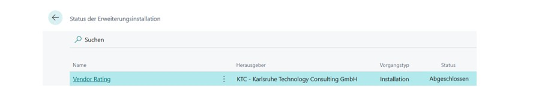 Fig.8 Check Installation complete

### Calling up the KTC License Management App

As soon as you install an app via the Marketplace or MS App Source, you must set up the KTC License Management App in order to use the corresponding app.
If you do not have the KTC License Management App yet, it will be installed together with ContractPlus. This app connects to the license server and lets you retrieve and manage the available licenses. 
Important: Please note that Vendor Rating is not operational without the license management app. Before the Vendor Rating app can be launched, the KTC License Management app must be set up. 
Important: To access the KTC License Management App, you must have SUPER or LIC LICENCE USER KTC rights. To open the license management, enter "KTC Liz" in the search and select the KTC License Management app.

 Fig.9 Calling up the KTC license management App

###	Initial Setup of the License Management App (New Customer)

To use ContractPlus as a new customer of our programs, please open the KTC License Management first. The program is automatically installed as soon as you have obtained ContractPlus from the AppSource. To do this, enter License in the search mask and select the KTC License Management administration program.

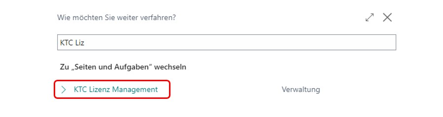 Fig.10 Calling up license management

When you initially start the KTC License Management App, your tenant ID is not yet set. This will be determined and set automatically in the next step.

 Fig.11 Setting up the KTC License Management Extension

Start the setup wizard and please enter your company name and email address. All extensions of the KTC will be assigned to this company name and e-mail address.
Attention: You need this e-mail address to restore the access data. For billing purposes, another e-mail address can be stored later.
Please read the license agreement and confirm that you have read and accept it.

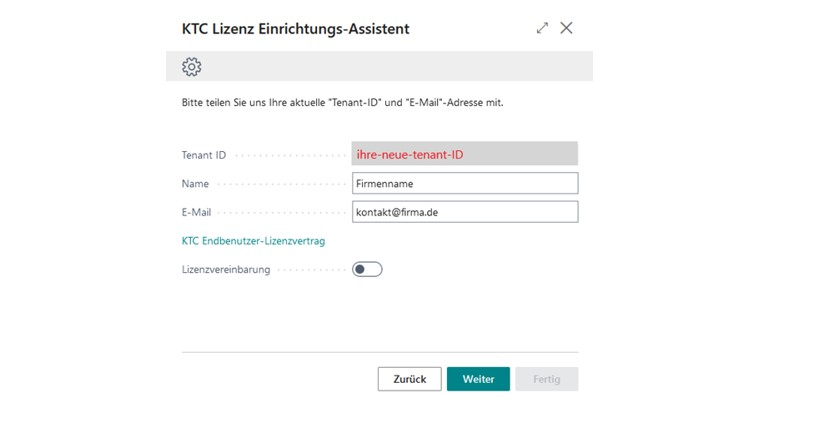 Fig.12 The KTC License Setup Wizard

Then confirm your entry with Next. The KTC will now automatically generate a password for you, with which you can log in to the license management.

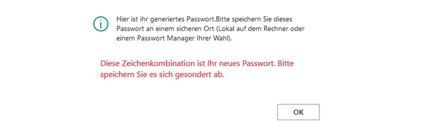 Fig.13 KTC License Management password (licensekey) 

Click OK to store the information. In the next window, click Done to complete the setup. The ContractPlus extension will now automatically appear in the overview of applications licensed via KTC.
Note: For security reasons, we do not save your password. Please save your password separately. You will need your password if you want to install the License Manager in additional environments such as sandboxes (e.g. multiple installations in different tenants with the same tenant ID). Forgotten passwords are always replaced by new passwords by the system.

###	Initial Setup of the License Management App (Existing Customers)

Since you have installed a KTC extension and you are already registered for the KTC License Management App.  You already have access to the app.
To complete the installation of the ContractPlus Extension, open the setup wizard of the KTC License Management App ( eg. via the search KTC License Management).

 Fig.14 Set up the KTC License Management extension 

After opening the setup wizard, please enter your existing credentials so that you can install the new extension on your tenant. Your tenant ID will be automatically filled in for you, so you only need to fill in your email and password. If you have forgotten your password, you can request a new one via "Forgot password?" (see Password of the KTC License Management App ).

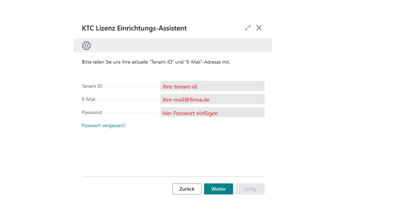 Fig.15 Setting up the KTC License Management App more than once

Please go to “Next” afterwards. The setup of the KTC License Management App is now complete. All valid KTC licenses are automatically imported from the KTC license server.
The ContractPlus App is now installed and shows up in your license overview.

 Fig.16 license overview 

The setup of the KTC License Management App is now complete. You can now use the ContractPlus App.

###	Reset password of KTC license management app

Use the Forgot password button to generate a new password (=license key). A new tab will open where you have to enter the email address linked to the license and click Submit.

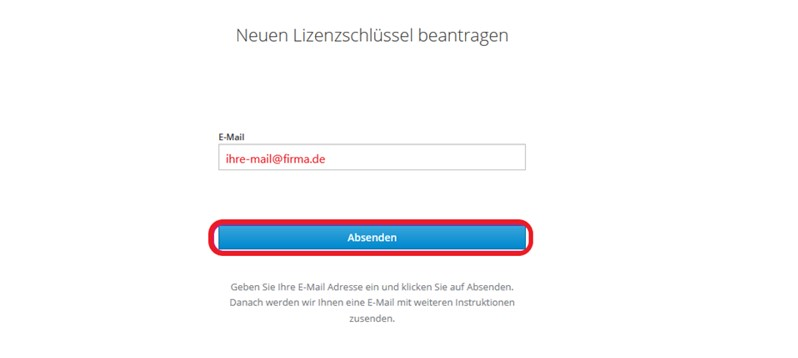 Fig.17  reset password (licensekey)

A link will be sent to this email. Click on the link to receive the new password. Please save this separately. The old password hereby loses its validity.

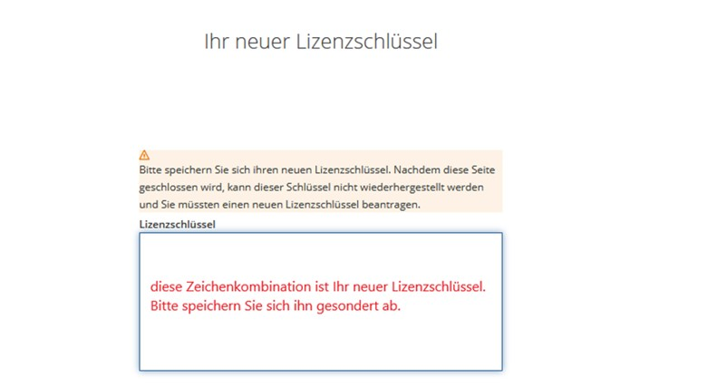 Fig.18 get new password (licensekey)

###	Management of KTC Licenses

If you want to check the status of your licenses, open the KTC License Management App and select the application you want to check (1) and click Update (2).
In the overview you can see if the license is valid, if you need detailed information, you can find more information under Manage.

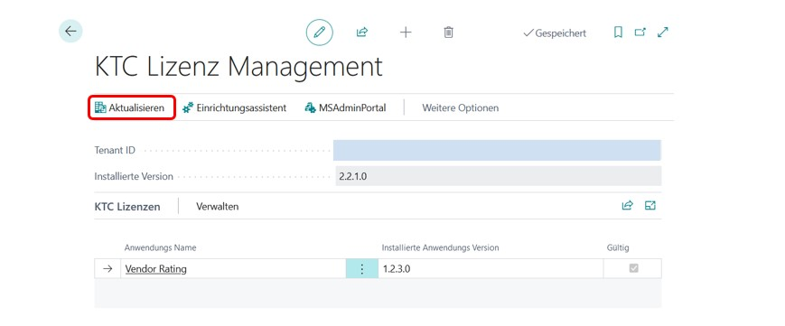 Fig.19  manually control the installed licenses

If you don't want to use the app anymore, you can mark the installed apps in the extension management and uninstall them.

### Update the application

The application is updated via the Microsoft Dynamics 365 Business Central Admin Center. The KTC License Management App additionally shows you if new versions of the KTC extensions are available.

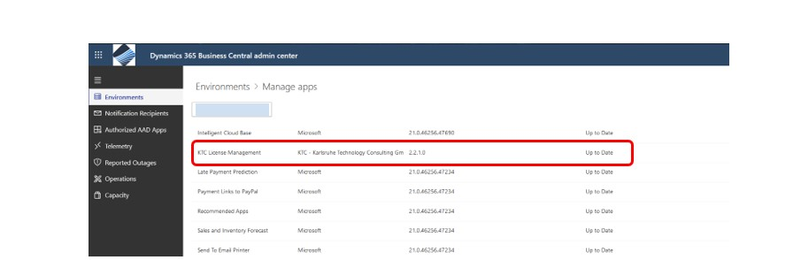 Fig.20  Open the Microsoft Dynamics 365 Business Central Admin Portal

To open your app overview, go to a list of installed apps via Environments manage apps. In this list you will see, among other things, the installed version and the information whether "your" version is also the current one (see Figure 20).

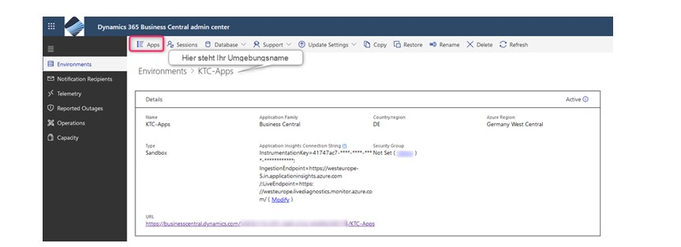 Fig.21 Choose environment in Dynamics 365 Business Central Admin Center

If necessary, you can update our application to the latest version here. To do this, you must first select the extension that you want to update.
To do this, go to Apps Manage Apps Update. The KTC License Management and ContractPlus applications will now be updated to the latest version. Once the update is complete, you can exit the Admin Center and continue working with the applications in your Business Central environment.

### Uninstall the application

In the Business Central Activity Overview search, type "extension" and select extension management.

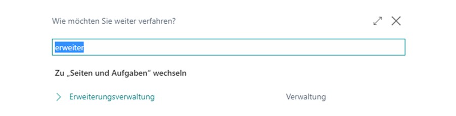 Fig.22 Calling up the extension management

Highlight the KTC License Management app and select Manage -> Uninstall. Alternatively, you can also click on the Yes that appears in front of the KTC License Management application in the extension overview. In the next window, select whether you also want to delete the data created in the extension and confirm the installation by clicking Uninstall. The application will now be removed from your system; all data of this application will be deleted.
Note: If KTC License Management is uninstalled, it will no longer be possible to use the Vendor Rating extension and any of our other products.

## Vendor Rating

 Fig.23  Logo of the Vendor Rating App

###Scope

Vendor Rating is a simple and uniform vendor rating for Microsoft Dynamics 365 Business Central. Here, attention was paid to a simple and self-explanatory implementation.
Rate your suppliers consistently and order accurately between 0 stars and 5 stars.
Furthermore, you can create any categories, which you can weight individually and from which the rating of the order is calculated.
Based on the individual ratings, the overall rating of the supplier is calculated. The following calculation methods are supported:

- Average : from all evaluated purchase orders. (Wikipedia | Weighted average, 2021)
- Linear weighting by the number of evaluations (the most recent order is given more weight than the oldest).

Hereby it becomes possible to make uniformly and centrally purchase defaults and/or to buy with bad suppliers no more. The evaluation is stored directly in the supplier and is available for general evaluations. Orders that are not rated are not included in the rating. Simple and intuitive.
Have an overview of your vendors' performance directly from Microsoft Dynamics 365 Business Central and sort your suppliers according to their rating. 
All according to the proven 0-to-5-star system. 

## A solution from KTC - competent, honest and reliable - The Vendor Rating App.: 

##	Licensing

The Vendor Rating App provides various licenses. Licensing is done via the KTC License Management App (see 4.2).
If you download and install the Vendor Rating App in the Marketplace or MS AppSource, you will automatically receive a 30-day trial license. 
After the license expires, to continue using Vendor Rating, contact us by email at Anfrage.D365BC-Apps@ktc.de, with information about the number of users you have. The current prices of the Vendor Rating App can be found in the SharePointPlus flyer. 
You need the VRA LIC User KTC to be able to use the Vendor Rating App.

###	Initial setup of the application

Important:  To access the Vendor Rating App setup page, you need SUPER or VRA ADMIN KTC rights. To use the SharePointPlus app, you need either the trial license or a purchased license. The rights you get with the licenses are called VRA LIC User KTC.

###	Activating SharePointPlus in the current client

You can activate or deactivate the Vendor Rating App for each client individually. To activate the Vendor Rating App, search for the "Configuration: Vendor Rating" setup page in the current client. 

 Fig.24 Activate and/or configure Vendor Rating

Please enable SharePoint Plus by activating the switch.  

 Fig.25 Vendor Rating App Configuration Page

### Configuration

Open the Page: Configuration Vendor Rating and the wizard will guide you through the process. 

 Fig.26 Activate Vendor Rating

1.	Choose your rating method
- Average - all evaluated orders go into the result calculation with the same weighting
- Linear (number) - the weighting of the reinforcement decreases linearly over the number.
2.	Shortcut of rating category
3.	Rating Category (Name)
4.	Weighting of the category
The weighting must be between 1 and 99. 

A weighting of 0 is not allowed and will generate an error message.

## 	User Scenario

###	New Field “Score” of the vendor and Score of the purchase order

Adding new fields in the vendor page list view.

 Fig.27 Vendor Page List View

Adding new fields in the vendor page view

 Fig.28 Vendor Page View

Adding new Fields in the Purchase Orders List View

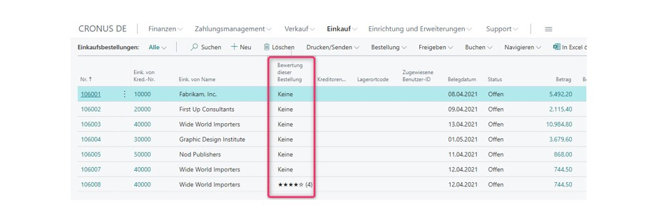 Fig.29 Purchase Orders List View
 
###	Vendor Rating the Purchase Order

1. 	A purchase order can be scored directly. (1)

2. 	Or the global value is calculated via the weighted individual evaluations of the categories. (2)

 Fig.30  Rate the Purchase Order

In this example we Score 5, 3 and 4 and the global score is calculated via the categories and the defined weighting in the setup page.

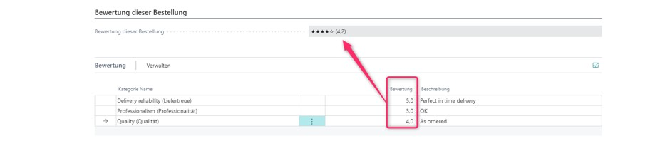 Fig.31  Rate over categories at the Purchase Order

With a weighting of
 Fig.32  Setup Page - Weighting

The numbers result in the following formula:
 Fig.33  Calculating the weighted average 

###	Permission sets

The Vendor Rating App has no permission sets installed.

###	Licensing
The licensing is user related. All system users of the environment are counted.
•	Test Period: 1-month free test period
•	Short year: monthly in advance until the end of the calendar year (31.12 current year)
•	Calendar year: annually in advance

###	Changelog

•	Adding categories and their individual weighting
•	Rating by categories or rating total
•	Bug fixing

####	Vendor Rating App Version 1.0 

•	Initial creation of the app
•	Orders can be rated between 0 and 5 stars
•	Different rating methods (average and linear by number).
•	Extending the detailed view of the supplier with the rating
•	Adding the supplier rating field in the list view of suppliers
•	Archiving of purchase orders including the rating

###	Roadmap

We are guided by the ideas of our customers - Please let us know your wishes.
•	Adding Permission Sets
•	Adding more languages (Italian, Croatian, Serbian, Polish, Russian, French, Spanish, ...)

## Availability
###	Supported Editions
The app supports the Essentials and Premium Editions of Microsoft Dynamics 365 Business Central.

###	Supported Countries
This app supports the following countries: Germany, Austria, Switzerland, United Kingdom and United States

### Supported Languages
This app is available in English (United States) and German (Deutschland).

### Support Languages
We provide paid support and training in English and German.
Please contact us by email: D365BC.VRA@ktc.de

### How to Buy
Visit our website at: https://ktc.de/bc/app/vra/
Here you will find the current prices and further information. 
Or contact us by email: D365BC.VRA@ktc.de

